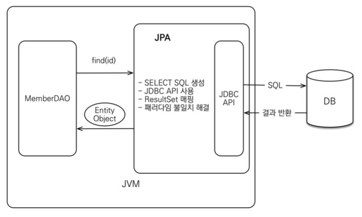

# 목차

<br>

- [목차](#목차)
- [1 SQL 맵핑의 문제](#1-sql-맵핑의-문제)
- [2 패러다임 불일치](#2-패러다임-불일치)
    - [2-1 상속](#2-1-상속)
    - [2-2 연관관계](#2-2-연관관계)
    - [2-3 객체 그래프 탐색](#2-3-객체-그래프-탐색)
    - [2-4 비교](#2-4-비교)
- [2 JPA란?](#2-jpa란)
    - [2-1 JPA란?](#2-1-jpa란)
    - [2-2 JPA를 왜 사용해야 하는가?](#2-2-jpa를-왜-사용해야-하는가)
    - [2-3 JPA 성능 최적화 기능](#2-3-jpa-성능-최적화-기능)

<br>

> 왜 ORM이 좋은지, JPA란 무엇인지 설명한다.

# 1 SQL 맵핑의 문제

<br>

**중복과 반복**
* SQL 맵핑의 문제점
    * 객체를 DB에 CRUD하려면 너무 많은 SQL와 JDBC 코드를 작성해야 한다.
    * 만약 객체에 새로운 상태가 생기면, 이와 관련된 객체의 CRUD 코드에 이를 수정 및 추가해줘야한다.
* **반복의 원인**
    * DB는 객체와 다르게 데이터 중심의 구조를 가지므로 객체를 DB에 직접 저장하거나 조회할 수 없다.
    * **개발자가 객체지향과 DB 중간에서 SQL과 JDBC를 사용해서 변환 작업을 직접 해줘야한다.**

<br>

**SQL에 의존적인 개발**

```java
// 연관된 객체 예시 코드 
class Member {
    private String memberId;
    private String name;
    private String tel;
    private Team team;
}

class Team {
    private String teamName;
}
```
* 연관된 객체 추가: Member가 특정 Team에 속해 있다고 해보자.
    * Member안에 Team 객체를 추가한다.
* **문제점**
    * **기존의 `memberDao.find(String memberId)`는 Team의 정보를 가져오지 않는다. 즉, Team이 `null`이다.**
    * DAO의 SQL문을 join문을 사용해서 수정해야 Team의 객체도 만들 수 있다. (`memberDao.findWithTeam`)
* **가장 큰 문제는 데이터 접근 계층을 사용해서 SQL을 숨겨도 어쩔 수 없이 DAO를 열어서 어떤 SQL이 실행되는지 확인해야한다.**
    * 즉, **개발자들이 엔티티를 신뢰하고 사용할 수 없다.**
    * **애플리케이션계층에서의 엔티티는 `null`이 아닌 연관된 엔티티가 존재한다는 확신이 있어야 데이터 접근 계층과 완벽히 역할을 분리할 수 있다.**
* **이는 진정한 의미의 계층 분할이 아니다.**
    * 물리적으로 SQL과 JDBC 코드를 숨겼을지 몰라도, 논리적으로 엔티티와 SQL이 아주 강한 의존관계를 가지게된다.

> 엔티티: 비즈니스 요구사항을 모델링한 객체.

<br>

**JPA와 문제해결**
* JPA는 이런 문제를 어떻게 해결했을까?
    * **저장: `jpa.persist(member)`**
        * JPA가 객체 매핑정보를 보고 적절한 INSERT SQL을 전달한다.
    * **조회: `Member member = jpa.find(Member.class, 1L)`**
        * JPA는 객체와 매핑정보를 보고 적절한 SELECT SQL을 전달하고 결과를 반환한다.
    * **수정: `member.setName("이름변경")`**
        * **JPA는 별도의 수정 메서드를 제공하지 않는다. 대신 객체를 조회해서 값을 변경하면 트랜잭션을 커밋할 때 DB에 적절한 UPDATE SQL을 전달한다.**
    * **연관된 객체 조회: `Team team = member.getTeam()`**
        * **JPA는 연관된 객체를 사용하는 시점에 적절한 SELECT SQL을 실행한다.**

<br>

# 2 패러다임 불일치

🤔 **패러다임 불일치?**
* 객체와 RDB는 지향하는 목적이 서로 다르므로 둘의 기능과 표현 방법이 다르다.
* 따라서 객체 구조를 테이블 구조에 저장하는 데는 한계가 있다.
* 객체를 RDB에 저장해야 한다면, 패러다임의 불일치 문제로 개발자가 중간에서 해결해줘야한다. (객체 -> 개발자 -> RDB)

<br>

:scream: **문제는 객체와 RDB 사이의 패러다임 불일치 문제를 해결하는 데 많은 시간과 코드를 소비한다.**

<br>

## 2-1 상속
객체는 상속이라는 기능을 가지고 있지만 테이블은 상속이라는 기능이 없다.

<p align="center"><br>출처: 자바 ORM 표준 JPA 프로그래밍</p>

* **패러다임의 불일치를 해결하려고 소모하는 비용이 크다. (개발자 야근..)**
    * 저장
        * 상위 클래스 Item에서 데이터만 꺼내고, 하위 클래스 Album에서 데이터만 꺼내서 따로 쿼리를 날려줘야한다.
        * 심지어 타입에 따라 DB에 DTYPE도 지정해줘야한다.
    * 조회
        * Album을 조회한다면 Item과 Album 테이블을 조인해서 조회한 다음 그 결과로 Album 객체를 생성해야한다.
* JPA는 이러한 문제를 대신 해결해준다.

<br>

## 2-2 연관관계
연관관계 부분에 있어서도 두 패러다임의 불일치가 발생한다.

<br>

<p align="center"><br>출처: 자바 ORM 표준 JPA 프로그래밍</p>

* **객체와 테이블의 연관관계**
    * 객체는 참조를 사용해 다른 객체와 연관관계를 가지고, 참조에 접근해서 연관된 객체를 조회한다.
        * `member.getTeam()`
    * 테이블은 외래 키를 사용해서 다른 테이블과 연관관계를 가지고 join을 사용해서 연관된 테이블을 조회한다.
        * `JOIN ON M.TEAM_ID = T.TEAM_ID`
* **방향성**
    * 객체는 방향성이 존재한다. (member -> team만 접근 가능)
    * 테이블은 방향성이 존재하지 않는다. (member <-> team 서로 접근 가능)

<br>

**테이블 주도 모델링**

```java
class Member {
    private String id;        // MEMBER_ID 사용
    private Long teamId;      // TEAM_ID FK 사용
    private String userName;  // USERNAME 사용
}
```
* 위 구조는 **RDB엔 좋지만, 객체지향의 특징은 잃어버리게 된다.**
    * RDB는 join을 사용해서 외래 키의 값을 그대로 보관해도 된다.
    * 객체는 참조값을 가지므로, Member를 조회해도 바로 사용할 수 없다.

<br>

**객체 주도 모델링**

```java
class Member {
    private String id;        // MEMBER_ID 사용
    private Team team;        // 참조로 연관관계를 맺음.
    private String userName;  // USERNAME 사용.
}
```
* 위 구조는 **객체지향의 특징은 살릴 수 있지만, 테이블에 저장하거나 조회하기가 쉽지 않다.**
    * 객체 모델은 외래 키가 필요없고 참조가 필요하다.
    * 반면에 테이블은 참조가 필요없고 외래 키만 필요하다.
* **결국, 개발자가 중간에서 변환 역할을 해야한다.**
    * join을 사용해서 Member와 Team을 DB로부터 가져와서 조립해줘야한다.

<br>

**JPA는 연관관계와 관련된 패러다임 불일치를 해결해준다**

```java
// 저장
member.setTeam(team); // 회원과 팀 연관관계 설정
jpa.persist(member);  // 회원과 연관관계 함께 저장

// 조회
Member member = jpa.find(Member.class, memberId);
Team team = member.getTeam(); // Team도 같이 조회된다.
```

<br>

## 2-3 객체 그래프 탐색

* **객체 그래프 탐색이란**
    * 객체의 참조를 이용해서 객체들을 탐색하는 것.
* 문제점: **SQL을 직접 다루면 처음 실행하는 SQL에 따라 객체 그래프를 어디까지 탐색할 수 있는지 정해진다.**
    * **DAO계층에서 받아온 객체가 어디까지 그래프 탐색이 가능한지 모른다. (어디까지가 `null`인지 아닌지 모르기 때문)**
    * **결국, 직접 DAO를 열어서 SQL을 직접 확인해야 한다. (계층 구조 파괴)**

<br>

**JPA는 지연 로딩 혹은 즉시 로딩을 통해 객체 그래프를 마음껏 탐색할 수 있다**

`member.getOrder().getOrderItem()....`

* 지연 로딩
    * JPA는 연관된 객체를 사용하는 시점에 적절한 SELECT SQL을 실행한다. (실제 사용할 때까지 DB 조회를 미룬다.)
* 지연 로딩은 설정할 수 있다.
    * 상황에 따라 지연 로딩이 더 비효율적일 수도 있다. 이를 위해 간편하게 설정해줄 수 있다고 한다.

<br>

## 2-4 비교
```java
// SQL 맵핑
Member member1 = memberDao.getMember(1);
Member member2 = memberDao.getMember(1);

member1 == member2; // false

// JPA
Member member1 = jpa.find(Memeber.class, 1);
Member member2 = jpa.find(Memeber.class, 1);

member1 == member2; // true
```
* DB와 객체의 비교방법
    * DB는 기본 키의 값으로 각 로우를 구분한다.
    * 객체는 동일성과 동등성 두 가지로 구분한다.
* **SQL 맵핑 방식의 DAO는 매번 새로운 객체를 만들어서 반환한다.**
    * DB의 같은 로우를 조회했어도 객체의 동일성 비교에선 실패하는 것.
* **JPA는 동일한 트랜잭션에서 조회한 엔티티는 같음을 보장한다.**

<br>

# 2 JPA란?

<br>

## 2-1 JPA란?

🤔 **JPA**
* Java Persistence API (인터페이스의 모음)
* 자바 진영의 ORM 기술 표준
* **영속 계층과 관련된 로직을 컬렉션 다루듯이 사용할 수 있도록 해준다.**

<br>

🤔  **ORM**
* Object-relational mapping (객체 관계 매핑)
    * 객체는 객체대로 설계
    * 관계형 데이터베이스는 관계형 데이터베이스대로 설계
* ORM 프레임워크가 중간에서 매핑

<br>

🤔 **JPA는 어떻게 동작하는가?**

<p align="center"><br>출처: 자바 ORM 표준 JPA 프로그래밍</p>

* JPA가 마법을 부리는 것이 아니다. 똑같이 JDBC를 사용해서 동작한다.
    * 다만, 객체만 구현하면 자동적으로 SQL코드와 JDBC코드를 만들어준다.

<br>

<p align="center"><br>출처: 자바 ORM 표준 JPA 프로그래밍</p>

<p align="center"><br>출처: 자바 ORM 표준 JPA 프로그래밍</p>

<br>

## 2-2 JPA를 왜 사용해야 하는가?
* SQL 중심적인 개발에서 객체 중심으로 개발
* 생산성
* 유지보수 -> 필드만 추가하면 SQL는 JPA가 처리
* 패러다임의 불일치 해결 -> 상속, 연관관계, 객체 그래프 탐색, 비교
* 성능
* 데이터 접근 추상화와 벤더 독립성
* 표준

<br>

## 2-3 JPA 성능 최적화 기능
> 흔히 JPA는 느리다고 생각하지만, 잘 사용하면 오히려 더 끌어올릴 수 있다고 한다.

<br>

**1. 1차 캐시와 동일성 보장**

1. 같은 트랜잭션 안에서는 같은 엔티티를 반환 - 약간의 조회 성능 향상
2. **DB 격리 수준이 Read Commit이어도 애플리케이션에서 Repeatable Read 보장**
   * 같은 트랜잭션 안에서 같은 엔티티를 바라보기 때문이다.

<br>

**2. 트랜잭션을 지원하는 쓰기 지연 - INSERT**

1. 트랜잭션을 커밋할 때까지 INSERT SQL 모음
2. JDBC Batch SQL 기능을 사용해서 한번에 SQL 전송

```java
transaction.begin(); // 트랜잭션 시작

em.persist(memberA);
em.persist(memberB);
em.persist(memberC);
// 여기까지 INSERT SQL을 데이터베이스에 보내지 않는다.

// 커밋하는 순간 데이터베이스에 INSERT SQL을 모아서 보낸다.
transaction.commit(); // 커밋
```

<br>

**3. 트랜잭션을 지원하는 쓰기 지연 - UPDATE**

1. UPDATE, DELETE로 인한 로우(ROW)락 시간 최소화
2. 트랜잭션 커밋 시 UPDATE, DELETE SQL 실행하고, 바로 커밋

```java
transaction.begin(); // 시작

changeMember(memberA);
deleteMember(memberB);
비즈니스_로직_수행() // 비즈니스 로직 수행 동안 DB 로우 락이 걸리지 않는다.

// 커밋하는 순간 데이터베이스에 UPDATE, DELETE SQL을 보낸다.
tranaction.commit(); // 커밋
```

❗️ JPA를 사용하면 DB의 성능을 조금 높일 수 있다.
* JPA를 사용하지 않고 SQL를 사용하여 직접 `update(memberA)`를 호출한다면 DB 테이블 로우에 락이 걸리게 된다.
  * **이 락은 `비즈니스_로직_수행()`을 수행하고 `commit`할 때까지 유지된다.** (다른 커넥션에선 해당 로우를 사용하지 못함 -> 성능 저하)
  * 물론 트랜잭션 격리 수준에 따라 다르지만 보통 많이 사용되는 Read Committed 격리 수준이나 그 이상에서는 DB에 현재 수정 중인 로우를 수정하려는 다른 트랜잭션은 락이 풀릴 때까지 대기해야한다.
* JPA를 사용한다면
  * **JPA는 커밋을 해야 그제서야 플러시가 동작하여 DB에 수정 쿼리를 보낸다.**
  * 즉, **`transaction.commit()`을 호출해야 `update(memberA)`, `deleteMember(memberB)`, `비즈니스_로직_수행()`이 실행되고 바로 DB 트랜잭션을 커밋한다.**
  * **쿼리를 보내고 바로 트랜잭션을 커밋하므로 DB에 락이 걸리는 시간을 최소화한다. 이는 동시에 많은 트랜잭션을 처리할 수 있다는 장점이 된다.**

트랜잭션 격리 수준에 따라 다르지만 보통 많이 사용하는 커밋된 읽기 Read Committed 격리 수준이나 그 이상에는 데이터베이스에 현재 수정 중인 데이터(로우)를 수정하려는 다른 트랜잭션은 락이 풀릴 때까지 대기한다.

쿼리를 보내고 보내고 바로 트랜잭션을 커밋하므로 결과적으로 데이터베이스에 락이 걸리는 시간을 최소화 한다. 이는 동시에 더 많은 트래잭션을 처리할 수 있다는 장점이 된다.


<br>

**4. 지연 로딩과 즉시 로딩**

<p align="center"><br>출처: 자바 ORM 표준 JPA 프로그래밍</p>

* 지연 로딩과 즉시 로딩은 설정을 통해 선택할 수 있다.

<br>

> 중간 계층이 있으면 할 수 있는 것.
> * 버퍼
> * 캐싱
