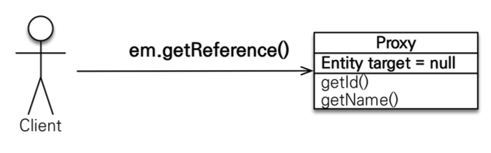
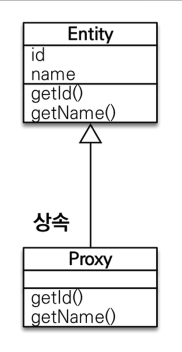
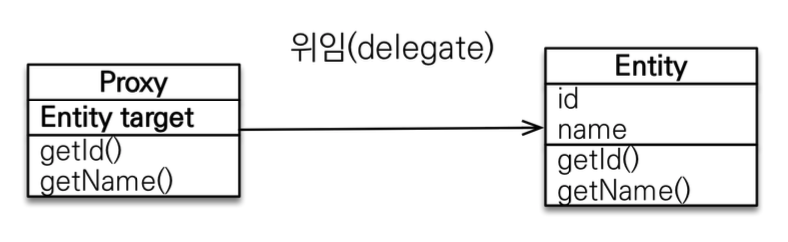
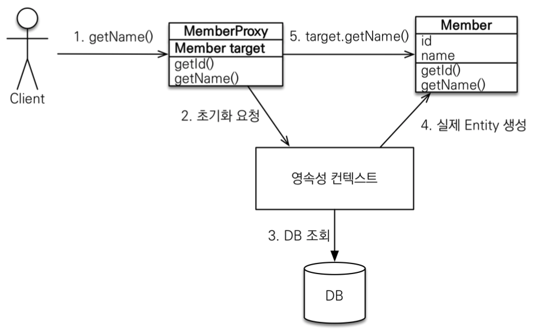

# JPA 놀이터 - 프록시

<br>

# 학습테스트 내용
- [프록시 테스트](./src/test/java/com/binghe/ProxyTest.java)
  - `em.find()`는 실제 엔티티 객체를 생성하고, `em.getReference()`는 프록시 객체를 생성한다.
  - 프록시 객체는 해당 객체의 속성이 사용될 때 비로서 쿼리를 날려 Target 객체를 가져온다.
  - 프록시 객체를 초기화할 때, 프록시 객체가 실제 엔티티로 바뀌는 것이 아니다. 초기화되면 프록시 객체를 통해서 실제 엔티티에 접근하는 것. (프록시 패턴)
  - getReference의 경우는 타입에 대한 == 비교가 불가능하다. instanceOf를 사용해야 함.
  - getReference를 통해 생성되는 프록시의 클래스 정보는 동일하다 (ByteBuddy를 통해 생성함)
  - 영속성 컨텍스트에 프록시 객체가 이미 있다면, 같은 id에 대한 find의 결과는 저장된 프록시 객체를 가져온다. (물론 쿼리를 통해 Target 객체도 가져온다.)
  - 영속성 컨텍스트에 찾는 엔티티가 이미 있으면 getReference를 호출해도 실제 엔티티를 반환한다.
  - 영속성 컨텍스트의 도움을 받을 수 없는 준영속 상태일 때, 프록시를 초기화하면 문제가 발생한다. -> LazyInitializationException

<br>

# 프록시

<br>

## getReference()

<p align="center"><br>출처: 자바 ORM 표준 JPA 프로그래밍</p>

* **JPA에서 조회하는 방법은 두 가지 존재한다.**
  * `em.find()`
  * `em.getReference()`
* **`em.find()`: 데이터베이스틑 통해서 실제 엔티티 객체를 조회한다.**
  * 진짜 객체를 주기 위해, 바로 DB 쿼리가 날라간다.
* **`em.getReference()`: 데이터베이스 조회를 미루는 가짜(프록시) 엔티티 객체 조회한다.**
  * 가짜 객체를 반환하고, 해당 객체의 속성이 사용될 때 쿼리가 날라간다.
  * **내부의 `target`이 실제 객체를 가리킨다.**

<br>

## 프록시 특징

**프록시 객체가 만들어지는 구조**

<p align="center"><br>출처: 자바 ORM 표준 JPA 프로그래밍</p>

* 실제 클래스를 상속 받아서 만들어진다.
  * 실제 클래스와 겉 모양이 같다. (프록시이므로 당연.)
* 사용하는 입장에서는 진짜 객체인지 프록시 객체인지 구분하지 않고 사용하면 된다. (이론상)

<br>

**타깃에게 위임**

<p align="center"><br>출처: 자바 ORM 표준 JPA 프로그래밍</p>

* 프록시 객체는 실제 객체의 참조(target)을 보관한다.
* 그리고 프록시 객체를 호출하면 프록시 객체는 실제 객체의 메서드를 호출한다. (위임한다.)

<br>

## 프록시 객체의 초기화

```java
Member member = em.getReference(Member.class, "id");
member.getName();
```

<p align="center"><br>출처: 자바 ORM 표준 JPA 프로그래밍</p>

**`getReference`를 통해 프록시(가짜) 객체를 생성하고, 이후에 `getName()`을 호출하면 아래와 같이 동작한다.**

1. `getName()` 호출
2. `Member.target`이 없다면 초기화 요청 (있다면 그대로 타겟 객체에게 메서드 위임한다.)
3. 영속성 컨텍스트는 초기화 요청을 받고, 진짜 객체(타깃)를 DB로 부터 조회한다.
4. 조회한 진짜 객체(타깃)객체를 프록시 객체의 타깃 속성(`Member.target`)에 주입해준다.

<br>

**초기화 특징**

* **프록시 객체는 처음 사용할 때 한 번만 초기화한다.**
* **프록시 객체를 초기화할 때, 프록시 객체가 실제 엔티티로 바뀌는 것이 아니다.**
  * 초기화되면 프록시 객체를 통해서 실제 엔티티에 접근하는 것. (위임하는 것)
* **프록시 객체는 원본 엔티티를 상속받는다. 따라서 타입 체크시 주의해야 한다.**
  * **그러므로 `==`비교는 실패한다. 대신 `instanceof`를 사용해야 한다.**
* **영속성 컨텍스트에 찾는 엔티티가 이미 있으면 `em.getReference()`를 호출해도 실제 엔티티를 반환한다.**
* **영속성 컨텍스트의 도움을 받을 수 없는 준영속 상태일 때, 프록시를 초기화하면 문제가 발생한다. -> 중요!!**
  * 하이버네이트는 `org.hibernate.LazyInitializationException` 예외를 터트림

<br>

## 프록시 확인
* **프록시 인스턴스의 초기화 여부 확인**
  * `PersistenceUnitUtil.isLoaded(Object entity)`
* **프록시 클래스 확인 방법**
  * `entity.getClass().getName()` 출력
    * `..javasist..or..HibernateProxy...`같은 결과값이 나옴
* **프록시 강제 초기화**
  * `org.hibernate.Hibernate.initialize(entity)`
  * JPA 표준은 강제 초기화가 없다. Hibernate은 지원해준다.
  * 강제 호출용으로 엔티티에 대한 아무 속성이나 메서드를 실행하면 된다. (ex. `member.getName()`)
