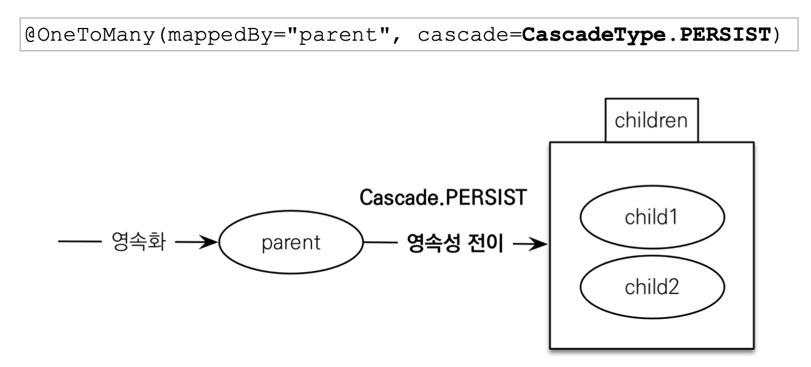

# JPA 놀이터 - 영속성 전이와 고아 객체

 

# 학습 테스트 내용
- [영속성 전이 (CASCADE) 테스트](./src/test/java/com/binghe/CascadeTest.java)
- [고아 객체 (Orphan) 테스트](./src/test/java/com/binghe/OrphanTest.java)

 

# 영속성 전이: CASCADE
> 의문: 영속성 전이를 설정하면 연관관계 주인이 아닌 객체가 FK 테이블을 변경할 수 있게 된다.
> 
> 그럼 영속성 전이와 연관관계 주인 권한을 주는 것과 무슨 차이가 있을까??
> 
> 결론: 

 

## 영속성 전이란?

 출처: 자바 ORM 표준 JPA 프로그래밍

* **영속성 전이란?**
  * 특정 엔티티를 영속 상태로 만들 때 연관된 엔티티도 함께 영속 상태로 만드는 것.
  * ex. 부모 엔티티를 저장할 때 자식 엔티티도 함께 저장.
* **영속성 전이 주의할 점**
  * **많이 오해하지만 영속성 전이는 즉시 로딩, 지연 로딩, 연관관계 맵핑과 전혀 관련이 없다.**
  * **엔티티를 영속화할 때 연관된 엔티티도 함께 영속화하는 편리함 을 제공할 뿐**
  * **영속성 전이를 받는 객체(child)가 다른 엔티티와도 관련이 있을 땐 사용하면 안된다. - 중요**
    * 즉, **소유자가 하나(단일 소유)일 때만 사용해야 한다.**
    * ex. 게시물에 저장되는 파일은 소유자가 게시물 하나이기 때문에 괜찮다.
    * 하지만, 만약 여러 게시물에서 소유한 파일이라면 영속성 전이를 사용하면 안된다. 예상치 못한 문제를 야기할 수 있기때문이다.
* 영속성 전이(CASCADE)의 종류
  * ALL: 모두 적용
  * PERSIST: 영속
  * REMOVE: 삭제
  * MERGE: 병합
  * REFRESH: REFRESH, DETACH: DETACH

 

## 고아 객체

* **고아 객체란?**
  * 부모 엔티티와 연관관계가 끊어진 자식 엔티티를 의미한다.
  * 참조가 제거된 엔티티는 다른 곳에서 참조하지 않는 고아 객체로보고 자동으로 삭제한다.
* **고아 객체 설정 방법**
  * `@OneToMany(mappedBy = "parent", cascade = CascadeType.ALL, orphanRemoval = true)`
* **개념적으로 부모를 제거하면 자식은 고아가 된다.**
  * 따라서 고아 객체 제거 기능을 활성화 하면, 부모가 제거할 때 자식도 함께 제거된다.
  * `CascadeType.REMOVE`처럼 동작하는 것.

 

**고아 객체 주의 사항**

* 참조하는 곳이 하나힐 때 사용해야 한다!
* 특정 엔티티가 개인 소유할 때 사용해야 한다!
  * 이유는 개념적으로 부모가 제거될 때 자식도 제거되기 때문이다.
  * 만약 자식 엔티티를 여러 부모 엔티티가 소유하게 된다면, 하나의 부모 엔티티가 제거되면서 여러 부모 엔티티가에서 공유하는 자식 엔티티가 삭제되므로 큰 오류가 발생할 수도 있다.

 

## 영속성 전이 + 고아 객체
> 영속성 전이와 고아 객체를 함께 사용할 수 있다.

* 보통은 스스로 생명주기를 관리하는 엔티티는 `em.persist()`로 영속화, `em.remove()`로 제거한다.
  * **각 엔티티들은 EntityManager가 생명주기를 관리한다.**
* 만약 `CascadeType.ALL` + `orphanRemoval = true` (영속성 전이 + 고아 객체)
  * **두 옵션을 모두 활성화하면 부모 엔티티를 통해서 자식의 생명주기를 관리할 수 있게 된다.**
  * 이는 DDD의 `Aggregate Root` 개념을 구현할 때 유용하다고 한다.
