# JPA 놀이터 - 영속성 컨텍스트

<br>

# 테스트 내용
* [영속성 컨텍스트 기능](./src/test/java/com/binghe/PersistenceContextTest.java)
  * 1차 캐싱
  * 동일성 보장
  * 트랜잭션을 지원하는 쓰기 지연 (쓰기 지연 SQL 저장소)
  * 더티체킹
* [Flush](./src/test/java/com/binghe/FlushTest.java)

<br>

# 목차

<br>

- [목차](#목차)
- [0 JPA 아키텍처](#0-jpa-아키텍처)
  - [0-1 Class Level Architecture](#0-1-class-level-architecture)
  - [0-2 JPA Class Relationship](#0-2-jpa-class-relationship)
- [1 영속성 컨텍스트](#1-영속성-컨텍스트)
  - [1-1 EntityManagerFactory와 EntityManager](#1-1-entitymanagerfactory와-entitymanager)
  - [1-2 영속성 컨텍스트란?](#1-2-영속성-컨텍스트란)
  - [1-3 엔티티의 생명주기](#1-3-엔티티의-생명주기)
  - [1-4 영속성 컨텍스트의 구조](#1-4-영속성-컨텍스트의-구조)
- [2 영속성 컨텍스트의 기능](#2-영속성-컨텍스트의-기능)
  - [2-1 1차 캐시](#2-1-1차-캐시)
  - [2-2 동일성 보장](#2-2-동일성-보장)
  - [2-3 트랜잭션을 지원하는 쓰기 지연](#2-3-트랜잭션을-지원하는-쓰기-지연)
  - [2-4 더티체킹](#2-4-더티체킹)
  - [2-5 지연 로딩](#2-5-지연-로딩)
- [3 플러시](#3-플러시)

<br>

**JPA에서 가장 중요한 2가지**

* 객체와 관계형 데이터베이스 매핑
* 영속성 컨텍스트

<br>

# 0 JPA 아키텍처
> JPA 아키텍처 관련된 자료는 [여기](https://www.tutorialspoint.com/jpa/jpa_architecture.htm)를 참조했다.

<br>

## 0-1 Class Level Architecture
<p align="center"><br>출처: https://www.tutorialspoint.com/jpa/jpa_architecture.htm</p>

* EntityManagerFactory: EntityManager의 팩토리 클래스. 여러 개의 EntityManager 인스턴스를 생성하고 관리한다.
  * 애플리케이션 로딩 시점에 DB당 딱 하나만 생성되어야 한다.
  * 애플리케이션이 종료되는 시점에 닫아줘야한다. (그래야 내부적으로 커넥션 풀에 대한 리소스가 해제된다.)
* EntityManager: 인터페이스이며, 객체에 대한 영속성 작업을 관리한다. Query 인스턴스의 공장처럼 동작한다.
  * 실제 Transaction 단위를 수행할 때마다 생성된다.
  * 즉, 고객의 요청이 올 때마다 사용했다가 닫는다.
  * Thread간에 공유하면 안된다.
* Entity: 엔티티는 DB 테이블에 저장되는 영속성 객체다.
* EntityTransaction: EntityManager와 일대일 관계. 각 EntityManager의 작업들은 EntityTransaction 클래스에 의해 유지된다.
  * **엔티티 혹은 데이터를 "변경"하는 모든 작업은 반드시 `Transaction` 안에서 이뤄져야한다.**
  * **단순한 조회의 경우 트랜잭션 안에서 할 필요없다. 이땐 Query를 사용하면 된다.**
* Persistence: EntityManagerFactory 인스턴스를 얻는 스태틱 메서드를 포함한다.
* Query: 이 인터페이스는 기준을 충족하는 관계형 객체들을 얻기 위해 JPA 벤더에 의해 구현된다.

<br>

## 0-2 JPA Class Relationship
아래 그림은 위 클래스들의 관계를 보여준다.

<p align="center">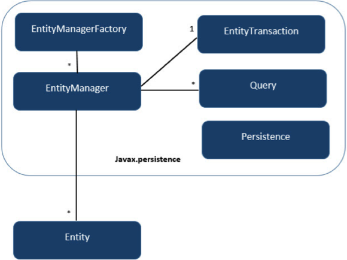<br> 출처: https://www.tutorialspoint.com/jpa/jpa_architecture.htm</p>

* EntityManagerFactory와 EntityManager는 1:N 관계이다.
* EntityManager와 EntityTransaction은 1:1 관계이다. 각 EntityManager의 작업에는 하나의 EntityTransaction 인스턴스가 존재한다.
* EntityManager와 Query는 1:N 관계이다. 많은 수의 Query를 하나의 EntityManager 인스턴스에서 실행할 수 있다.
* EntityManager와 Entity는 1:N 관계이다. 하나의 EntityManager는 여러 개의 Entity를 관리할 수 있다.

<br>

# 1 영속성 컨텍스트
> JPA의 내부 구조를 이해하기 위해선 영속성 컨텍스트의 이해가 필요하다.

<br>

## 1-1 EntityManagerFactory와 EntityManager
> 영속성 컨텍스트를 알기전에 엔티티매니저팩토리와 엔티티매니저에 대한 이해가 필요하다.

<p align="center">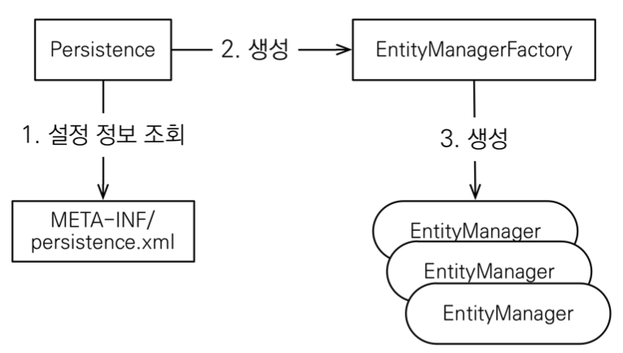<br>출처: 자바 ORM 표준 JPA 프로그래밍</p>

<p align="center">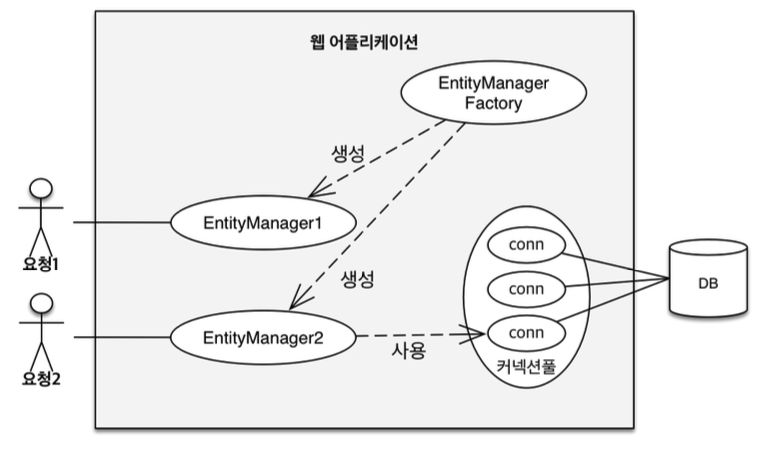<br>출처: 자바 ORM 표준 JPA 프로그래밍</p>

<br>

**엔티티매니저팩토리와 엔티티매니저**

* **EntityManagerFactory는 하나만 생성해서 애플리케이션 전체에서 공유한다.**
  * 애플리케이션 로딩 시점에 딱 하나 (DB당 하나)
* **EntityManager는 쓰레드간에 공유하면 안된다. (사용하고 버려야 한다.)**
  * 클라이언트 요청 마다 하나
  * **DB 트랜잭션 단위로 생성하고 제거한다.**
* **JPA의 모든 데이터 변경은 트랜잭션 안에서 실행해야한다.**
* **엔티티 매니저를 통해서 영속성 컨텍스트에 접근한다.**

<br>

**엔티티 매니저와 영속성 컨텍스트**

<p align="center">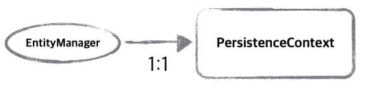
<br>출처: 자바 ORM 표준 JPA 프로그래밍</p>

J2SE환경에선 엔티티 매니저와 영속성 컨텍스트가 1:1 관계를 가진다.

<p align="center">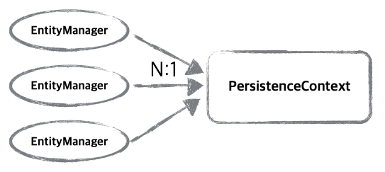<br>출처: 자바 ORM 표준 JPA 프로그래밍</p>

반대로 J2EE, 스프링 프레임워크와 같은 컨테이너 환경에선 N:1 관계를 가진다.

<br>

## 1-2 영속성 컨텍스트란?
* 영속성 컨텍스트(Persistence Context)란
  * **엔티티를 관리하고 영속화(영구 저장)시키는 환경**
    * ex. `EntityManager.persist(entity)`: DB가 아닌 영속성 컨텍스트에 저장한다는 의미.
  * 논리적인 개념이므로, 눈에 보이지 않는다.
    * **엔티티 매니저를 통해서 접근하기 때문.**
* 애플리케이션과 DB 사이에서 엔티티를 관리해주는 환경.

<br>

## 1-3 엔티티의 생명주기

<p align="center">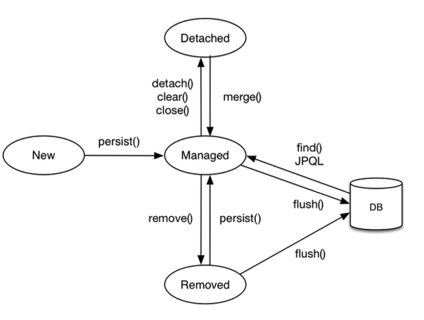<br>출처: 자바 ORM 표준 JPA 프로그래밍</p>

<br>

**비영속 (new/transient)**

<p align="center">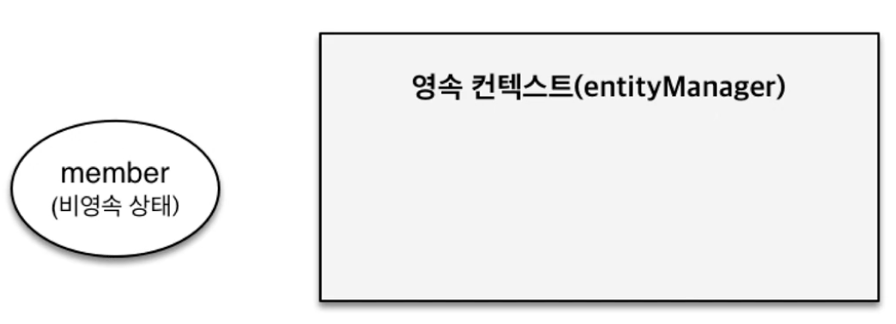<br>출처: 자바 ORM 표준 JPA 프로그래밍</p>

```java
// 객체를 생성한 상태
Member member = new Member();
member.setId(100L);
member.setName("binghe");
```

* 비영속은 **영속성 컨텍스트와 전혀 관계가 없는 새로운 상태**를 의미한다.

<br>

**영속 (managed)**

<p align="center">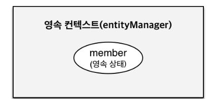<br>출처: 자바 ORM 표준 JPA 프로그래밍</p>

```java
// 객체를 생성한 상태 (비영속)
Member member = new Member();
member.setId(100L);
member.setName("binghe");

EntityManager em = emf.createEntityManager();
em.getTransaction().begin();

// 객체를 저장한 상태 (영속)
em.persist(member);
```

* 영속은 **영속성 컨텍스트에 관리되는 상태**를 의미한다.

<br>

**준영속 (detached)삭제**
```java
// 준영속 상태: 엔티티를 영속성 컨텍스트에서 분리
em.detach(member);
```

* 영속 -> 준영속으로 상태가 변경된다.
  * 영속 상태의 엔티티가 영속성 컨텍스트에서 분리(detached)
  * 분리하고나면 영속성 컨텍스트가 관리 안하므로, 플러시 혹은 커밋을 해도 아무 일도 일어나지 않는다.
  * 이때 DB에는 반영되지 않는다. (만약 DB에도 반영(삭제)하고 싶다면 준영속 전에 commit을 해주어야 한다.)
* 영속성 컨텍스트가 제공하는 기능을 사용 못한다.
* 준영속을 만드는 방법
  * `detached(entity)`: 특정 엔티티만 준영속 상태로 전환
  * `clear()`: 영속성 컨텍스트를 완전히 초기화
  * `close()`: 영속성 컨텍스트를 종료

<br>

**삭제**

```java
// 삭제: 객체를 삭제한 상태
em.remove(member);
```

<br>

## 1-4 영속성 컨텍스트의 구조

* 영속성 컨텍스트는 크게 1차 캐시 저장소와 쓰기 지연 SQL 저장소로 구성되어있다.
  * 1차 캐시 저장소
  * 쓰기 지연 SQL 저장소


<br>

# 2 영속성 컨텍스트의 기능

<br>

## 2-1 1차 캐시
```java
Member member = new Member();
member.setId(100L);
member.setName("binghe");

// 1차 캐시에 저장됨
em.persist(member);

// 1차 캐시에서 조회
Member findMember = em.find(Member.class, 100L);
// 데이터베이스에서 조회 (영속 컨텍스트에 존재하지 않는 멤버)
Member findMember2 = em.find(Member.class, 150L);
```
* **JPA를 통해 `find`를 호출하면 다음과 같은 순서로 동작한다.**
  1. 1차 캐시에서 조회
  2. 데이터베이스에서 조회 (1차 캐시에 없다면)
* **DB로부터 데이터를 가져오면 1차 캐싱에 저장해두고, 동일 트랜잭션 안에서 컬렉션처럼 동작한다.**

<br>

<p align="center">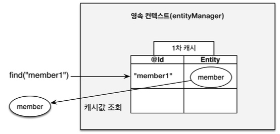<br>1차 캐시에서 조회<br><br>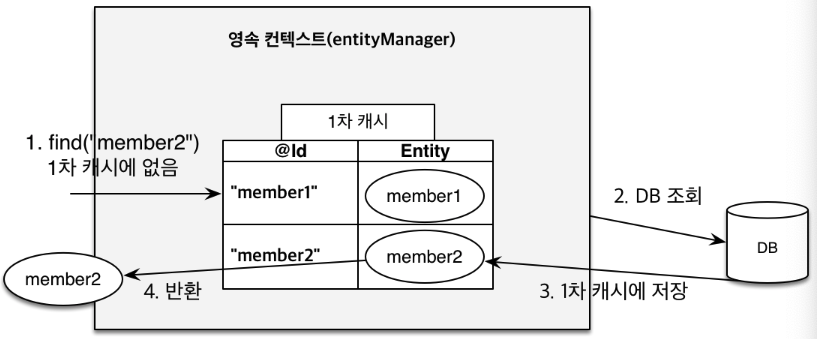<br>데이터베이스에서 조회<br>출처: 자바 ORM 표준 JPA 프로그래밍</p>

<br>

> 🤔 **성능상의 큰 이득이 있는가?**
> * **EntityManager는 트랜잭션 단위로 생성하고 제거한다.**
    >   * 즉, 클라이언트의 요청당 하나의 EntityManager를 생성하고 지운다.
> * 그럼으로, **모든 클라이언트가 엔티티를 공유하도록 캐싱하는 것이 아니라, 한 요청에 대한 트랜잭션 안에서만 캐싱을 하는 것.**
> * 즉, 조금의 성능상 이득이 있다. 

<br>

> 더 정확히는 영속성 컨텍스트가 종료되기 전까지는 엔티티가 영속성 컨텍스트에 남아있는다. (1차 캐시 사용 가능)
>
> **해당 트랜잭션의 시작과 끝에서만 짧게 유지되는 캐시**
>
> 일반적으론 트랜잭션의 범위와 영속성 컨텍스트의 범위를 맞추어서 개발하기 때문에 위와같이 설명한 것.

<br>

## 2-2 동일성 보장
```java
Member a = em.find(Member.class, 1L);
Member b = em.find(Member.class, 1L);

a == b; // true (동일성 비교)
```
* 영속성 컨텍스트는 동일성을 보장한다.

> **영속성 컨텍스트를 하나의 Collection으로 보면 된다.**

<br>

## 2-3 트랜잭션을 지원하는 쓰기 지연
```java
EntityManager em = emf.createEntityManager();
EntityTransaction transaction = em.getTransaction();
// 엔티티 매니저는 데이터 변경시 트랜잭션을 시작해야 한다.
transaction.begin(); // 트랜잭션 시작

em.persist(memberA);
em.persist(memberB);
// 여기까지 INSERT SQL을 DB에 보내지 않는다.

// 커밋하는 순간 DB에 INSERT SQL을 보낸다.
transaction.commit(); // 커밋
```

<p align="center">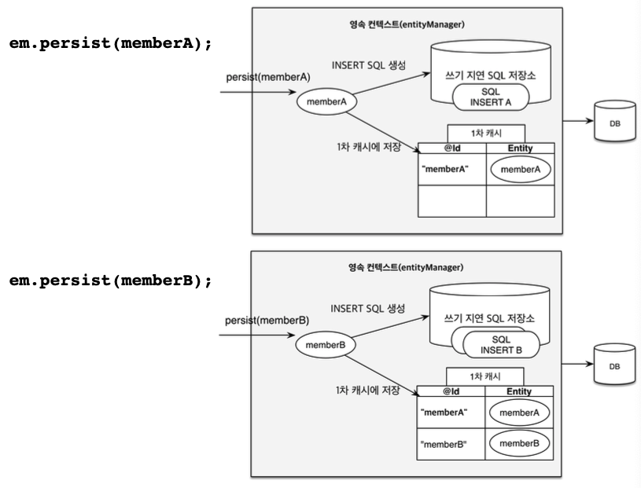<br>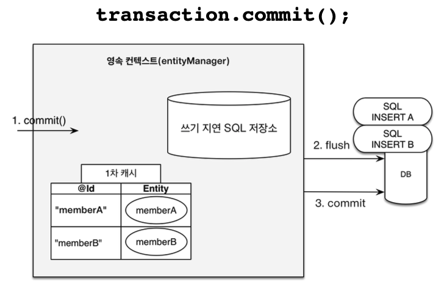<br>출처: 자바 ORM 표준 JPA 프로그래밍</p>

<br>

> flush할 때 JDBC의 Batch 기능을 이용해서 한번에 쿼리를 날린다.

<br>

## 2-4 더티체킹
> 변경 감지 (엔티티 수정시 이를 체킹하여 영속적으로 수정하도록 하는 기능)

```java
EntityManager em = emf.createEntityManager();
EntityTransaction transaction = em.getTransaction();
transaction.begin(); // 트랜잭션 시작

// 영속 엔티티 조회
Member memberA = em.find(Member.class, 100L);

// 영속 엔티티 데이터 수정
memberA.setUsername("hi");
memberA.setAge(10);

// em.update(member) -> 이런 코드가 없어도 자동으로 변경을 체크하여 쿼리를 날린다.

transaction.commit(); // 커밋
```

<p align="center">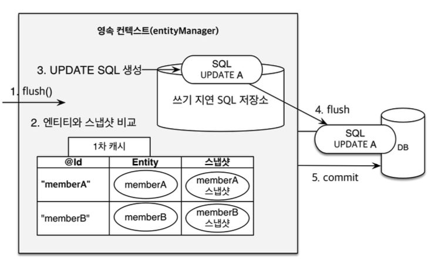<br>출처: 자바 ORM 표준 JPA 프로그래밍</p>

* **변경을 감지하는 원리**
  * 영속 컨텍스트에서 DB로부터 데이터를 가져올 때 1차 캐시안에 스냅샷을 찍어둔다.
  * 그리고 추후에 **트랜잭션이 커밋되는 시점에 엔티티와 스냅샷을 비교한다.**
  * 비교하여 변경을 감지하여 UPDATE 쿼리를 생성하여 쓰기 지연 SQL 저장소에 저장한다.
* 스냅샷이란?
  * 영속성 컨텍스트에 들어온 최초의 값을 기록 (DB로부터든(`find`) 비영속으로부터든(`persist`))

<br>

> JPA의 목적이 컬렉션 다루듯 객체를 다루는 것.
>
> 컬렉션 다루는 것을 생각해보면, 위 내용이 쉽게 다가온다. (참조값을 통한 수정)

<br>

## 2-5 지연 로딩
```java
// Member의 Team은 지연로딩 설정되어있다고 가정한다면

// 저장
member.setTeam(team); // 회원과 팀 연관관계 설정
em.persist(member);  // 회원과 연관관계 함께 저장

// 조회
Member member = em.find(Member.class, memberId); // 이때 Team은 같이 조회하지 않는다.
Team team = member.getTeam(); // 실제 Team을 조회할 때야 비로소 SELECT 쿼리를통해 Team을 지연로딩한다.
```

* **지연 로딩이란?**
  * **연관된 엔티티를 실제 사용할 때 로딩하는 것.**
  * **즉, 연관된 엔티티를 사용하는 시점에 쿼리를 날리는 것.**
  * **즉시 로딩은 엔티티를 조회할 때 연관된 엔티티도 함께 조회하는 것.**

<br>

# 3 플러시


* **플러시란?**
  * **영속성 컨텍스트의 변경내용(엔티티의 변경 -> 등록, 수정, 삭제)을 DB에 반영하는 것.**
  * 영속성 컨텍스트에 쌓아뒀던 쿼리들을 DB에 날려주는 것.
  * **보통 트랜잭션 커밋될 때 플러시가 발생한다. (commit 호출시 flush를 호출한 다음에 commit)**
* **플러시 사용시 오해하면 안되는 부분**
  * **플러시는 영속성 컨텍스트를 비우는 것이 아님. (1차 캐시 그대로 남아있는다)**
    * 플러시를 하여 동기화한 다음에 영속성 컨텍스트는 그대로 유지된다.
  * **플러시는 영속성 컨텍스트의 변경내용을 DB에 동기화.**
  * 중요한 점은 트랜잭션이라는 작업 단위가 중요 -> 커밋 직전에만 동기화하면 됨.
* **플러시가 발생하면**
  * 변경 감지
  * 수정된 엔티티 쓰기 지연 SQL 저장소에 등록
  * 쓰기 지연 SQL 저장소의 쿼리를 DB에 전송 (등록, 수정, 삭제 쿼리)
* **영속성 컨텍스트 플러시하는 방법**
  * 직접 호출: `em.flush()`
  * 트랜잭션 커밋: 플러시 자동 호출
  * JPQL 쿼리 실행: 플러시 자동 호출
* **플러시 모드 옵션 (`em.setFlushMode(FlushModeType.XXX)`)**
  * `FlushModeType.AUTO`: 커밋이나 쿼리를 실행할 때 플러시 (기본값)
  * `FlushModeType.COMMIT`: 커밋할 때만 플러시
