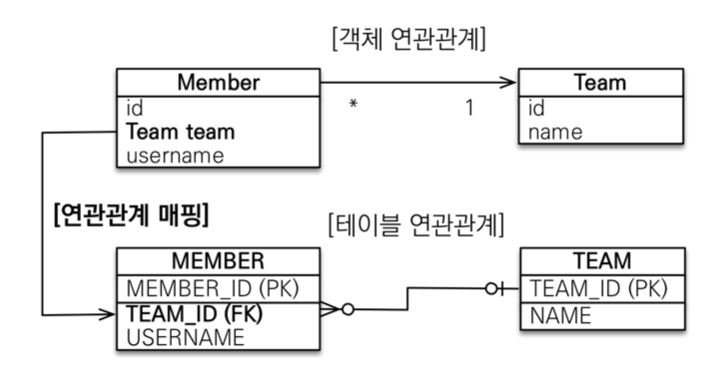
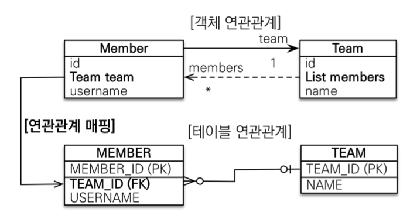

# JPA 놀이터 - N : 1

 

# 학습 테스트 내용
- [N : 1 단방향](./src/test/java/com/binghe/one_way/OneWayTest.java)
- [N : 1 양방향](./src/test/java/com/binghe/two_way/TwoWayTest.java)

 

# 다대일 N : 1

 

## 다대일의 특징
* **DB 테이블의 일(1), 다(N) 관계에서 외래 키는 항상 다(N)쪽에 있다.**
  * 따라서 **객체 양방향 관계에서 연관관계의 주인은 항상 다(N)쪽이다**
  * 주인이 아닌 객체는 조회를 위한 JPQL이나 객체 그래프를 탐색할 때 사용한다.
* **양방향 연관관계는 항상 서로를 참조해야 한다.**
  * **항상 서로 참조하게 하려면 연관관계 편의 메서드를 작성하는 것이 좋다.** 
    * `member.setTeam(team)`안에 `team.addMember(this)`도 넣어주자!
  * **편의 메서드는 한 곳에만 작성하거나 양쪽 다 작성할 경우, 무한루프에 빠지지 않도록 검사하는 로직이 있어야한다.**

 

## 단방향

 출처: 자바 ORM 표준 JPA 프로그래밍

* DB입장에서 생각해보면 MEMBER N : 1 TEAM인 경우, N(다)쪽에 FK가 가야한다.
    * 아니면 설계가 잘못된 것.
* 객체상에서도 DB상에서의 FK가 있는 쪽에 `@ManyToOne`을 붙여주면 된다.

 

## 양방향

 출처: 자바 ORM 표준 JPA 프로그래밍

* 외래 키가 있는 쪽이 연관관계의 주인
* 양쪽을 서로 참조하도록 개발
* **객체상에선 양방향으로 변경되지만, DB 테이블상에선 아무런 수정사항이 없다.**

 

# 일대다 1 : N
뒤에서 다루겠지만, 연관관계 주인을 1에 두는 1 : N 관계는 여러모로 단점이 존재한다.

다시말해 1 : N 는 N : 1과 반대이며, Team이 연관관계를 관리하겠다는 설계구조이며, 이는 여러가지 단점이 존재한다.

이와 관련해서는 [1 : N]() 에서 더 자세히 다룬다.
