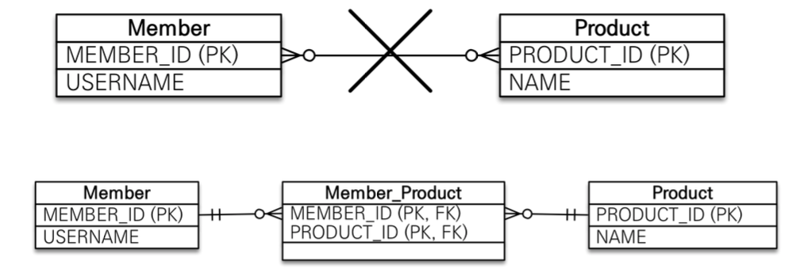
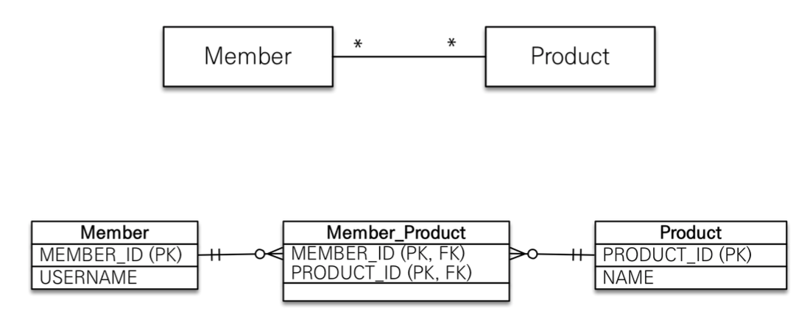
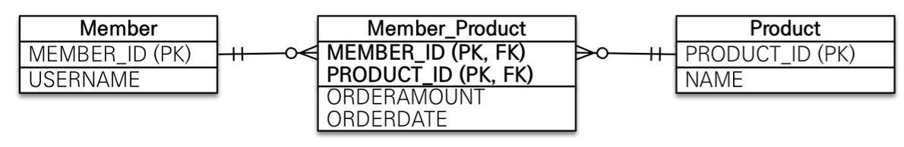
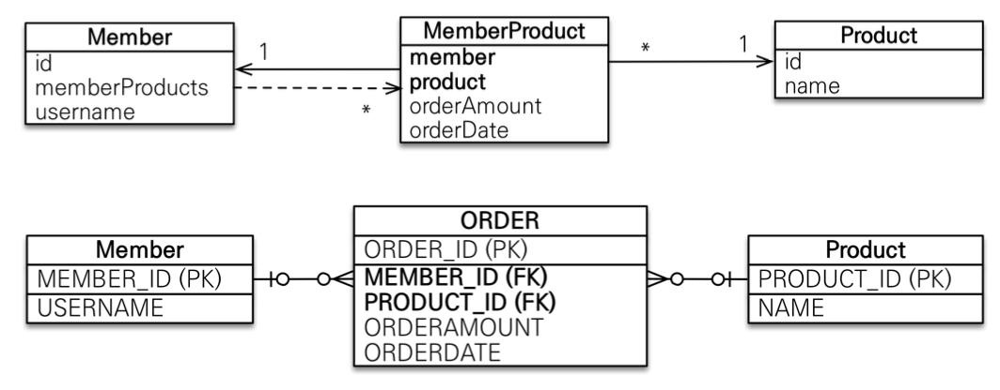

# JPA 놀이터

 

## 학습 테스트 내용
- [N : N 단방향 테스트](./src/test/java/com/binghe/one_way/OneWayTest.java)
- [N : N 양방향 테스트](./src/test/java/com/binghe/two_way/TwoWayTest.java)
- [N : N -> 1 : N + N + 1 테스트](./src/test/java/com/binghe/one_to_many_many_to_one/OneToManyManyToOneTest.java)

 

# 다대다 N : N

 

**DB에서의 다대다**

 출처: 자바 ORM 표준 JPA 프로그래밍

* RDB는 정규화된 테이블 2개로 다대다 관계를 표현할 수 없다.
* 연결 테이블을 추가해서 일대다, 다대일 관계로 풀어내야한다.

 

**객체에서의 다대다**

 출처: 자바 ORM 표준 JPA 프로그래밍

* RDB와 다르게 객체는 다대다를 표현할 수 있다.
    * 즉, 객체는 컬렉션을 사용해서 객체 2개로 다대다 관계가 가능하다.

 

**다대다 사용법**

* `@ManyToMany` 사용
* `@JoinTable`로 연결 테이블(중간 테이블) 지정
* 다대다 맵핑도 단방향, 양방향 모두 가능하다.

 

**다대다의 한계 - 중요**

 출처: 자바 ORM 표준 JPA 프로그래밍

* **다대다가 편리해보이지만 실무에서 사용하면 안된다.**
    * 이유는 연결 테이블이 단순히 연결만 하고 끝나지 않기 때문이다.
        * **맵핑만 가능하고 연결되는 두 객체안에 추가 데이터를 넣을 수 없다.**
    * 또한, 중간 테이블이 숨겨져있기 때문에 쿼리도 복잡해진다. 조인 지옥.

 

**다대다 한계 극복 - 중요**

 출처: 자바 ORM 표준 JPA 프로그래밍

* 연결 테이블용 엔티티 추가 (연결 테이블을 엔티티로 승격시키는 것!)
* `@ManyToMany` -> `@OneToMany` + `@ManyToOne`

> 가능한 다대다 관계를 사용하지 않는 것이 좋고, 만약 사용할 일이 있으면 1 : N + N : 1 방식을 사용하라.
