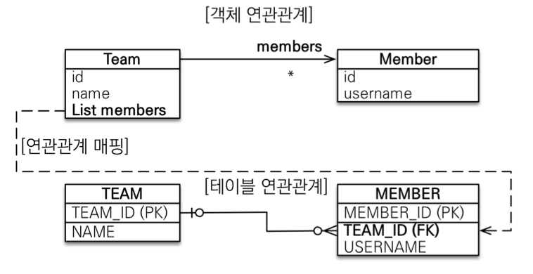
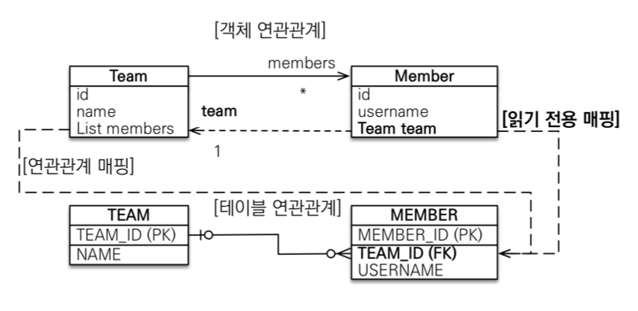

# JPA 놀이터 - 1 : N

 

# 학습 테스트 주제
- [1:N 단방향 테스트](./src/test/java/com/binghe/one_way/OneWayTest.java)
- [1:N 양방향 테스트](./src/test/java/com/binghe/two_way/TwoWayTest.java)

 

# 일대다 1 : N
> 김영한님의 별로 추천하지 않은 관계라고 한다.

일대다는 다대일과 반대이며, Team이 관리를 하겠다는 설계구조.

 

**단방향**

 출처: 자바 ORM 표준 JPA 프로그래밍

* **연관관계의 주인**
    * 일대다 단뱡향은 **일(1)이 연관관계의 주인**이된다.
* **테이블 외래키**
    * 테이블 일대다 관계는 항상 **다(N) 쪽에 외래 키**가 있다.
* **특징**
    * **객체 와 테이블의 차이 때문에 반대편 테이블의 외래 키를 관리하는 특이한 구조**
    * **`@JoinColumn`을 꼭 사용해야 함. 그렇지 않으면 조인 테이블 방식을 사용한다. (중간에 테이블을 하나 추가함..)**
* **일대다 단방향 매핑의 단점**
    * **엔티티가 관리하는 외래 키가 다른 테이블에 있다. (심각한 문제)**
        * `Team`객체 안에서 `Member`를 가지지만, 테이블상에서 외래 키가 `Member`에 있다. (**방향성이 서로 다르다.**)
    * **연관관계 관리를 위해 추가로 UPDATE SQL을 실행한다.**
    * 영한님의 추천: **일대다 단방향 매핑보다는 다대일 양방향 매핑을 사용하라.**
        * 객체지향적으로 가지 않는 방향성이라도 트레이프오프 차원에서 다대일 양방향을 선택.
        * DB의 상황을 맞춰서 선택하는 사항.

> 결론
> * 연관관계 주인이 반대편 테이블의 외래 키를 관리한다.
> * 이로 인해 연관관계 관리를 위해 추가로 UPDATE SQL을 실행해야한다.

 

**양방향**

 출처: 자바 ORM 표준 JPA 프로그래밍

* **일대다 단방향 매핑은 공식적으로 제공하지 않는다. 단, 야매로 할 수 있다.**
* **양방향 설정 방법**
    * 연관관계의 주인이 아닌 쪽에 `@ManyToOne`과 `@JoinColumn(insertable = false, updateable = false)`설정을 주면 된다.
    * 위 애노테이션의 의미는 **읽기 전용 필드**(추가할 수도, 업데이트할 수도 없다)를 가리킨다.
    * 만약 위 설정을 해주지 않으면 연관관계의 주인이 두 개가 되므로, 망한다..
        * JPA 스펙에서도 양방향은 항상 한쪽이 `mappedBy`가 되어야 한다고 한다.

> 영한님의 추천: 현업에선 거의 사용되지 않는다. 다대일 양방향을 사용하라..

 
