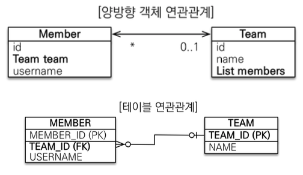
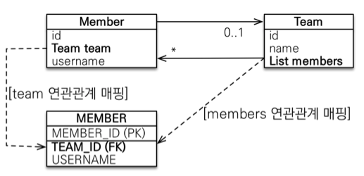
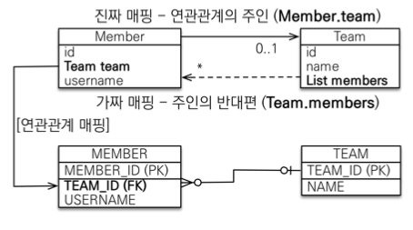

# JPA 놀이터 - 연관관계 매핑 기초

<br>

# 학습 테스트 내용
- [N:1 상황에서 연관관계 단방향 테스트](./src/test/java/com/binghe/one_way/OneWayTest.java)
- [N:1 상황에서 연관관계 양방향 테스트](./src/test/java/com/binghe/two_way/TwoWayTest.java)

<br>

# 목차

<br>

- [목차](#목차)
- [연관관계가 필요한 이유](#연관관계가-필요한-이유)
    - [연관관계가 없을 경우 - 중요](#연관관계가-없을-경우---중요)
- [양방향과 연관관계의 주인](#양방향과-연관관계의-주인)
    - [객체와 테이블이 관계를 맺는 차이 - 중요](#객체와-테이블이-관계를-맺는-차이---중요)
    - [연관관계 주인](#연관관계-주인)
    - [누구를 주인으로 해야하는가?](#누구를-주인으로-해야하는가)
- [양방향 매핑시 조심해야 할 부분](#양방향-매핑시-조심해야-할-부분)
    - [항상 양쪽 다 값을 입력하라](#항상-양쪽-다-값을-입력하라)
    - [양방향 매핑시에 무한 루프를 조심하라](#양방향-매핑시에-무한-루프를-조심하라)
    - [양방향 매핑 정리](#양방향-매핑-정리)

<br>

**이번 챕터의 목표**

1. 객체와 테이블 연관관계의 차이를 이해
2. 객체의 참조와 테이블의 외래 키를 매핑

<br>

**용어 정리**

* 방향: 단방향, 양방향
* 다중성: 다대일(N:1), 일대다(1:N), 일대일(1:1), 다대다(N:N)
* 연관관계의 주인: 객체 양방향 연관관계는 관리 주인이 필요하다. (가장 어려운 개념)

<br>

# 연관관계가 필요한 이유
> 여기서 말하는 연관관계는 객체간의 연관관계를 의미한다.

객체지향의 목표는 협력하는 객체 세상이다.

그렇다면 연관관계가 굉장히 중요하다.

이번 챕터에선 객체간의 연관관계가 중요한지 살펴본다.

<br>

## 연관관계가 없을 경우 - 중요
🤔 **객체간의 연관관계가 없을 경우란?**
* 객체를 테이블에 맞추어 모델링하는 것을 의미한다.
* 즉, 객체 참조 대신 외래 키(Long id)를 그대로 사용하는 것.

<br>

:scream: **문제점**
* 외래 키 식별자를 직접 다룬다.
    * ex. `member.setTeamId(team.getId())`
* 객체와 연관되어있는 객체들을 id를 통해 다시 조회한다. (객체지향적인 방법이 아니다.)
  ```java
  // 멤버 조회
  Member findMember = em.find(Member.class, member.getId());
  
  // 연관관계가 없이 id를 통해 다시 조회
  Team findTeam = em.find(Team.class, team.getId());
  ```

<br>

💁‍♂️ 객체를 테이블에 맞추어 데이터 중심으로 모델링하면, 협력 관계를 만들 수 없다.
* **테이블은 외래 키로 조인을 사용**해서 연관된 테이블을 찾는다.
* **객체는 참조를 사용**해서 연관된 객체를 찾는다.
* 테이블과 객체 사이엔 이러한 큰 간격이 있다.

<br>

# 양방향과 연관관계의 주인
> 여기서 말하는 양방향이란 객체들 간의 관계를 말한다.

<br>

## 객체와 테이블이 관계를 맺는 차이 - 중요
<p align="center"><br>출처: 자바 ORM 표준 JPA 프로그래밍</p>

<br>

* **객체의 양방향 관계**
    * **객체의 양뱡향 관계는 사실 양방향 관계가 아니라 서로 다른 단방향 관계 2개다.**
    * 즉, 객체를 양방향으로 참조하려면 단방향 연관관계를 2개 만들어야한다.
    * 방향성이 존재한다.
  ```java
  class A {
      B b;
  }

  class B {
      A a;
  }
  ```
* **테이블의 양방향 관계**
    * **테이블은 외래 키 하나로 두 테이블의 연관관계를 관리한다.**
    * 즉, 외래 키 하나로 양방향 연관관계를 가질 수 있다.
    * **방향성이 없다. 그냥 외래 키(FK)만 있으면 양방향 모두 접근 가능.**
  ```sql
  SELECT *
    FROM MEMBER M
    JOIN TEAM T ON M.TEAM_ID = T.TEAM_ID
  SELECT *
    FROM TEAM T
    JOIN MEMBER M ON T.TEAM_ID = M.TEAM_ID
  ```

> 테이블의 경우 단방향과 양방향 모두 테이블 구조상의 차이는 없다.

<br>

## 연관관계 주인

<br>

🤔 **연관관계 주인이라는 개념이 왜 나왔을까?**

<p align="center"><br>객체에선 단방향 두개가, 테이블에선 하나의 외래키로 관리할 수 있다.<br>출처: 자바 ORM 표준 JPA 프로그래밍</p>

* 위 그림을 보면 테이블의 경우 외래 키를 사용해서 두 테이블의 연관관계를 관리한다.
    * 그렇다면 테이블 MEMBER에 TEAM을 join 할 수도, TEAM에 MEMBER를 join 할 수도 있다. 만약 조회한다면 뭘 해야할까?
    * 또한, 회원의 팀을 바꾸고 싶다면, 테이블상에선 MEMBER 테이블만 변경해주면 되지만, 객체상에선 객체 Member의 Team을 변경해야할지, 객체 Team의 Member를(리스트에서 Member 삭제, 추가) 변경해야할지 모른다.
    * 객체 Member에서 Team을 변경하는 것과, 객체 Team에서 Member를 변경하는 것중. 뭘 해야할까?
* 한마디로, **양방향의 두 객체중 하나만을 통해 테이블 MEMBER를 수정해야한다.**
    * **즉, 두 객체가 양방향의 연관관계를 가진다면, 둘 중 하나로 외래 키를 관리해야한다.**
* **이럴때 바로 연관관계의 주인을 정해줘야한다는 것.**
    * 만약 `Member`객체를 주인으로 하면, `Team.members`에 아무리 add해도 DB에는 들어가진 않는다.

<br>

🤔 **연관관계 주인이란?**
* 양방향 매핑에서의 규칙을 의미한다.
* **객체의 두 관계중 하나를 연관관계의 주인으로 지정해줘야한다.**
    * 객체에서의 양방향은 두 단방향, 테이블에서의 양방향은 외래 키 하나로 되므로, 객체에서는 하나로 주인을 정해주어야한다.
* **연관관계 주인 역할을 하는 객체가 변경되었을 때만 테이블에 쿼리가 날라간다.**

<br>

💁‍♂️ **연관관계 주인의 특징**
* **연관관계의 주인만이 외래 키를 관리(등록, 수정)한다.**
* **주인이 아닌 쪽은 읽기만 가능하다.**
    * 주인은 `mappedBy` 속성 사용 불가.
    * 주인이 아니면 `mappedBy`속성으로 주인을 지정한다. (**스펙상 꼭 해줘야한다**.)

<br>

## 누구를 주인으로 해야하는가?

<br>

<p align="center"><br>출처: 자바 ORM 표준 JPA 프로그래밍</p>

💁‍♂️ **김영한님의 추천**
* **외래 키가 있는 곳을 주인으로 정해라.**
    * 위 예제에서는 `Member.team`이 연관관계의 주인이된다.
* **비즈니스 로직을 기준으로 연관관계의 주인을 선택하면 안된다.**
    * 물론, 비즈니스적으로 보면 자동차와 바퀴중 자동차가 더 중요해보이지만, 연관관계의 주인은 바퀴가 된다.

<br>

<br>

# 양방향 매핑시 조심해야 할 부분

<br>

## 항상 양쪽 다 값을 입력하라

```java
Team team = new Team();
team.setName("TeamA");
em.persist(team);

Member member = new Member();
member.setName("binghe");

// 역방향(주인이 아닌 방향)만 연관관계 설정
team.getMembers().add(member);

em.persist(member);
```
* 위와 같이 연간관계의 주인에 값을 입력해주지 않으면 DB에 쿼리가 안날라간다.
    * `Member`객체가 주인, `Team`은 주인이 아님.
    * `Team`에만 추가해봤자, JPA는 쿼리를 안날린다.

<br>

**양방향 매핑시 연관관계의 주인에 값을 입력해야 한다**

```java
Team team = new Team();
team.setName("TeamA");
em.persist(team);

Member member = new Member();
member.setName("member");

team.getMembers().add(member);
// 연관관계의 주인에 값 설정
member.setTeam(team);

em.persist(member);
```
* **`member.setTeam(team)`과 같이 주인에 넣어줘야 DB에 쿼리가 날라간다.**
    * **순수한 객체 관계를 고려하면 항상 양쪽 다 값을 입력해주는 것이 좋다. - 중요**
* **결론은 양방향 매핑시 객체상 양쪽에 모두 값(참조값)을 세팅하는 것이 좋다.**

<br>

## 양방향 매핑시에 무한 루프를 조심하라
```java
@Entity
public class Member {
    // 상태, getter, setter

    @Override
    public String toString() {
        return "Member{" +
            "id=" + id +
            ", team=" + team +
            ", name='" + name + '\'' +
            '}';
    }
}

@Entity
public class Team {
    // 상태, getter, setter
    @Override
    public String toString() {
        return "Team{" +
            "id=" + id +
            ", name='" + name + '\'' +
            ", members=" + members +
            '}';
    }
}

// StackOverFlow 발생
System.out.println(findTeam.getMembers().toString());
```
* 위와 같이 `toString()`을 재정의하면, `Team`안의 `List<Member> members`의 `toString()`을 호춣하다보면 계속해서 순환 참조가 일어나게된다.
    * 그러므로 스택오버플로우가 발생한다.
* **문제는 lombok이나 JSON 생성 라이브러리를 사용할 때 조심해야한다는 것.**
    * 가능한 직접 DTO로 변환해서 JSON 라이브러리를 사용하는 것이 좋다.

<br>

## 양방향 매핑 정리
* **양방향 매핑은 반대 방향으로 조회(객체 그래프 탐색)기능이 추가된 것 뿐.**
    * 가능한 단방향 매핑만으로 설계를 하라. 양방향을 지양하자.
* **단방향 매핑을 잘 하고 양방향은 필요할 때 추가해도 됨.**
    * 양방향안다고 테이블에 영향을 주지 않기 때문이다.
* **JPQL을 사용하여 역방향으로 탐색할 일이 많다고 한다.** 

