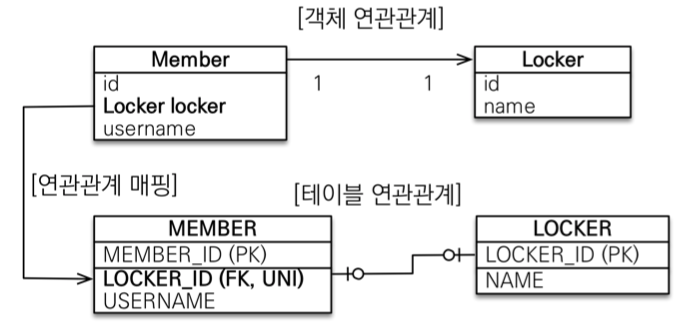
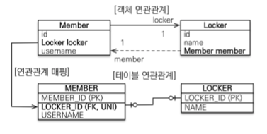
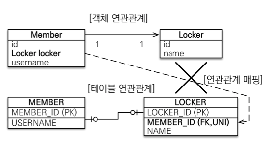
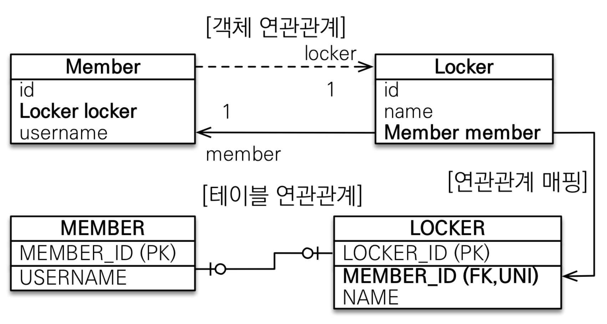
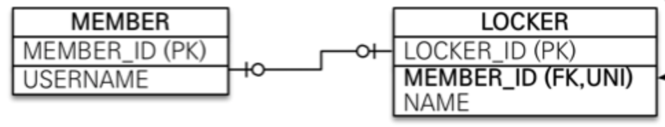
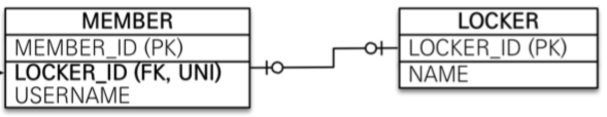

# JPA 놀이터 - 1 : 1

 

## 학습 테스트

 

# 일대일 1 : 1

* **일대일 관계의 특징**
    * 일대일 관계는 그 반대도 일대일이다.
    * 그러므로, 주 테이블이나 대상 테이블 중에 외래 키를 선택 가능하다.
        * 주 테이블에 외래 키 혹은 대상 테이블에 외래 키
    * 단, 외래 키에 데이터베이스 유니크(UNI)제약 조건을 추가해줘야한다.

 

**주 테이블에 외래 키 단방향**

 출처: 자바 ORM 표준 JPA 프로그래밍

* 일대일은 객체에 매핑되는 두 테이블 중 하나에 외래 키를 넣을 수 있다.
    * 가장 이해하기 좋은 것은 반대편 객체를 가지고 있는 객체(의존성을 가지고 있는 객체) 테이블에 외래키를 넣는 것.
    * 그래서 위 예시에서는 `Member`가 주 테이블.
* 다대일(`@ManyToOne`) 단방향 매핑과 유사하다. (애노테이션만 달라질 뿐.)

 

**주 테이블에 외래 키 양방향**

 출처: 자바 ORM 표준 JPA 프로그래밍

* **다대일 양방향 매핑처럼 외래 키가 있는 곳이 연관관계의 주인(외래키 관리인)이된다.**
* 반대편에 동일하게 `mappedBy`를 적용시켜줘야한다.

 

**대상 테이블에 외래 키 단방향**

 출처: 자바 ORM 표준 JPA 프로그래밍

* 대상 테이블의 외래 키를 사용한 단방향 관계는 JPA에서 지원을 해주지 않는다.
    * 그 이유는 ...
* 양방향 관계는 지원해준다.

 

**대상 테이블에 외래 키 양방향**

 출처: 자바 ORM 표준 JPA 프로그래밍

* 주 테이블 외래 키 양방향에서 그냥 반대로 뒤집은 것.
    * 즉, 1 : 1 주 테이블에 외래 키 양방향과 매핑 방법은 같음

 

🤔 **그럼 양방향을 사용할 때 주 테이블과 대상 테이블 중 어느것에 외래 키를 둬야할까? - 중요**

* **정답은 확장성을 고려해서 many가 될 가능성이 높은쪽을 연관관계 주인(외래키 관리자)로 만들어주는 것이 좋다. (DB상에서 uni 제약만 지워주면 된다.)**
  
 출처: 자바 ORM 표준 JPA 프로그래밍

    * 즉, 위 예시에서 Member가 여러 Locker를 가지도록 할수도 있기 때문에, Locker가 외래 키를 가지고 있는 것이 더 확장에 유연할 수 있다.

  
 출처: 자바 ORM 표준 JPA 프로그래밍

    * 반대로 하나의 Locker를 여러 Member가 가진다면, 외래 키를 Member가 가지도록 하는 것이 더 확장에 유연할 수 있다.

 

**일대일 정리**

* 주 테이블에 외래 키
    * 주 객체가 대상 객체의 참조를 가지는 것 처럼 주 테이블에 외래 키를 두고 대상 테이블을 찾음
    * 객체지향 개발자 선호
    * JPA 매핑 편리
    * 장점: 주 테이블만 조회해도 대상 테이블에 데이터가 있는지 확인 가능
    * 단점: 값이 없으면 외래 키에 null 허용
* 대상 테이블에 외래 키
    * 대상 테이블에 외래 키가 존재
    * 전통적인 데이터베이스 개발자 선호
    * 장점: 주 테이블과 대상 테이블을 일대일에서 일대다 관계로 변경할 때 테이블 구조 유지
    * 단점: 프록시 기능의 한계로 지연 로딩으로 설정해도 항상 즉시 로딩됨(프록시는 뒤에서 설명)
