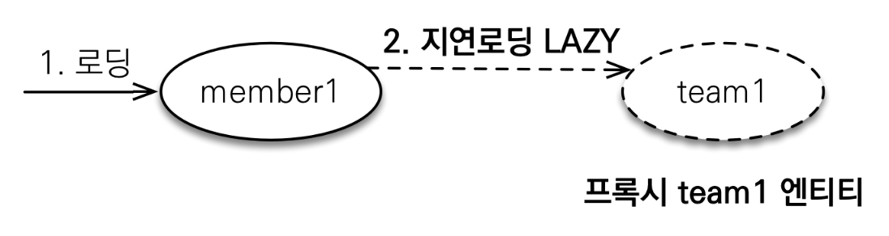
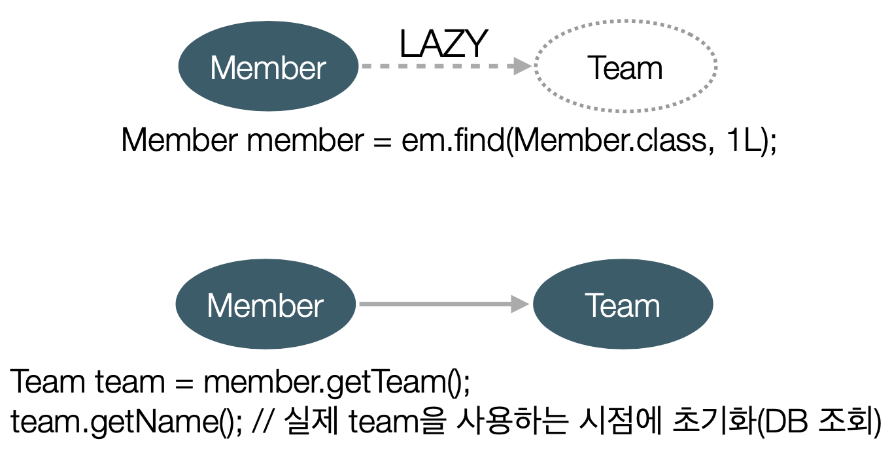
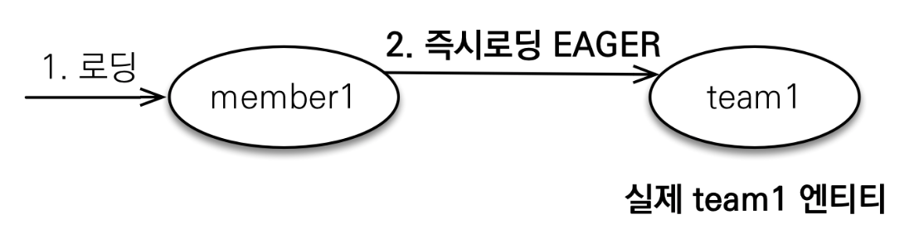

# JPA 놀이터 - 지연 로딩과 즉시 로딩

 

# 학습 테스트 내용
- [지연 로딩](./src/test/java/com/binghe/LazyTest.java)
- [즉시 로딩](./src/test/java/com/binghe/EagerTest.java)

 

# 지연 로딩과 즉시 로딩

 

## 지연 로딩

 

**지연 로딩이란**

 출처: 자바 ORM 표준 JPA 프로그래밍

 

 출처: 자바 ORM 표준 JPA 프로그래밍

* fetch 설정값을 FetchType.LAZY로하면 해당 의존성 객체는 프록시 객체를 만든다. 그리고 사용하는 시점에 쿼리를 통해 가져온다.

 

## 즉시 로딩

 

**즉시 로딩이란**

 출처: 자바 ORM 표준 JPA 프로그래밍
  

* fetch 설정값을 FetchType.Eager로하면 해당 객체를 가져올 때, join을 통해 한번에 가져온다.

 

**프록시와 즉시 로딩 주의**
* **가급적 지연 로딩만 사용해야 한다.**
  * 이유는 **즉시 로딩을 적용하면 예상하지 못한 SQL이 발생할 수 있기 때문이다.**
  * 또한, **즉시 로딩은 N+1 문제를 일으킬 수 있다.**
* 모든 연관관계에 지연 로딩을 사용해라!
