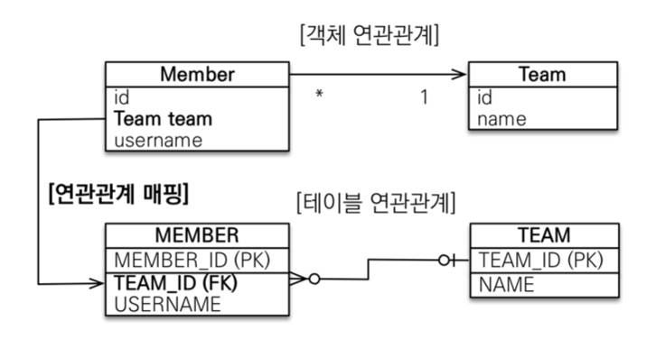
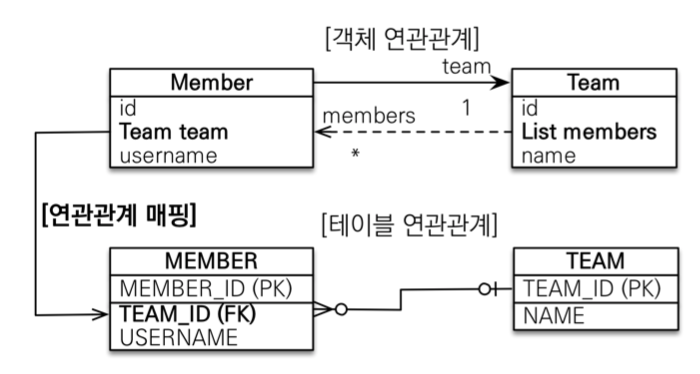

# JPA 놀이터 - N : 1

 

# 학습 테스트 내용
- [N : 1 단방향](./src/test/java/com/binghe/one_way/OneWayTest.java)
- [N : 1 양방향](./src/test/java/com/binghe/two_way/TwoWayTest.java)

 

# 다대일 N : 1

 

## 다대일의 특징
* **DB 테이블의 일(1), 다(N) 관계에서 외래 키는 항상 다(N)쪽에 있다.**
  * 따라서 **객체 양방향 관계에서 연관관계의 주인은 항상 다(N)쪽이다**
  * 주인이 아닌 객체는 조회를 위한 JPQL이나 객체 그래프를 탐색할 때 사용한다.

 

## 단방향

 출처: 자바 ORM 표준 JPA 프로그래밍

* DB입장에서 생각해보면 MEMBER N : 1 TEAM인 경우, N(다)쪽에 FK가 가야한다.
    * 아니면 설계가 잘못된 것.
* 객체상에서도 DB상에서의 FK가 있는 쪽에 `@ManyToOne`을 붙여주면 된다.

 

## 양방향

 출처: 자바 ORM 표준 JPA 프로그래밍

* 외래 키가 있는 쪽이 연관관계의 주인
* 양쪽을 서로 참조하도록 개발
* **객체상에선 양방향으로 변경되지만, DB 테이블상에선 아무런 수정사항이 없다.**

 

# 일대다 1 : N
> 김영한님의 별로 추천하지 않은 관계라고 한다.

일대다는 다대일과 반대이며, Team이 관리를 하겠다는 설계구조.
