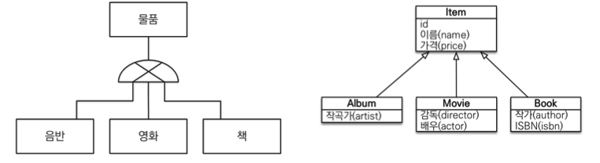
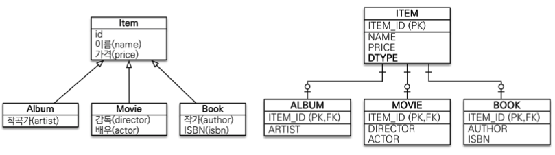
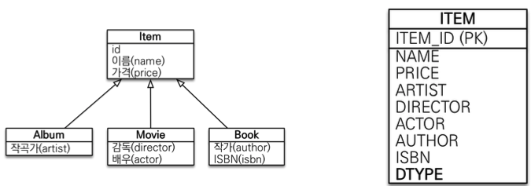
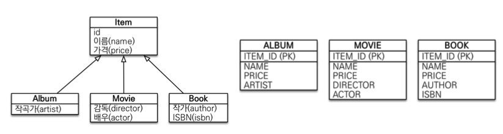

# JPA 놀이터 - 상속관계 매핑

 

# 학습테스트 내용
- [상속관계 매핑 테스트 -> 여러 가지 전략을 테스트하고 싶으면 애노테이션을 수정하면 된다.](./src/test/java/com/binghe/AbstractMappingTest.java)

 

# 상속관계 매핑

 

## 상속관계 매핑이란?

 왼쪽이 DRB, 오른쪽이 객체 출처: 자바 ORM 표준 JPA 프로그래밍

* 객체와 RDB의 상속관계
  * 객체는 상속관계가 존재한다.
  * RDB는 상속 관계가 존재하지 않는다.
* RDB도 상속과 유사한 방법이 존재한다.
  * 슈퍼타입 서브타입 관계라는 모델링 기법이 객체 상속과 유사하다.
* **상속관계 매핑이란?**
  * 객체의 상속 구조와 RDB의 슈퍼타입 서브타입 관계를 매핑하는 것.

 

## RDB 상속관계 구현방법
> 객체에선 동일하지만, DB 테이블에서 구현하는 방법을 설명한다.

슈퍼타입 서브타입 논리 모델을 실제 물리 모델로 구현하는 방법
* 각각 테이블로 변환 -> 조인 전략
* 통합 테이블로 변환 -> 단일 테이블 전략
* 서브타입 테이블로 변환 -> 구현 클래스마다 테이블 전략

 

1. **Join 전략**

 출처: 자바 ORM 표준 JPA 프로그래밍

* 데이터를 가져올 때 join을 통해 같이 가져오는 방식
  * 삽입은 두번, 조회는 join을 통해 한번.
  * 서브타입이 무엇인지 알기 위해서 슈퍼타입에 타입(`DTYPE`)을 따로 저장한다.
  * ex. 새로운 ALBUM이 들어온다면 이름, 가격은 ITEM에, 아티스트는 ALBUM 테이블에 저장.
* 장점
  * 테이블 정규화 -> 저장공간 효율화
  * 외래 키 참조 무결성 제약조건 활용가능
* 단점
  * 조회시 조인을 많이 사용 -> 성능 저하
  * 조회 쿼리가 복잡함
  * 데이터 저장시 INSERT SQL 2번 호출

 

1. **단일 테이블 전략**

 출처: 자바 ORM 표준 JPA 프로그래밍

* 논리 모델을 한 테이블에 합치는 방식
  * 모든 슈퍼, 서브타입의 속성을 하나에 때려 박고, `DTYPE`을 통해 구분하는 방식.
  * `DTYPE`은 무조건 필요하다. (`@DiscriminatorColumn`을 자동으로 넣어줌)
* 장점
  * 조인이 필요 없으므로 일반적으로 조회 성능이 빠름
  * 조회 쿼리가 단순함
* 단점
  * 자식 엔티티가 매핑한 컬럼은 모두 null 허용 (자신이 가지고 있지 않는 값을 모두 null처리)
  * 단일 테이블에 모든 것을 저장하므로 테이블이 커질 수 있다. 상황에 따라서 조회 성능이 오히려 느려질 수 있다.

 

3. **구현 클래스마다 테이블 전략**

 출처: 자바 ORM 표준 JPA 프로그래밍

* 슈퍼, 서브타입 객체 상관없이 각각 테이블이 속성을 가지는 방식.
  * 별로 추천하지 않는다.
* 장점
  * 서브 타입을 명확하게 구분해서 처리할 때 효과적
  * not null 제약조건 사용 가능
* 단점
  * 여러 자식 테이블을 함께 조회할 때 성능이 느림 (UNION SQL 필요)
    * `Movie`를 넣고, `Item`으로 찾아오면 UNION을 통해 가져오므로 성능이 느려짐.
    * 명확하게 조회할 때만 성능 저하가 없다.
  * 자식 테이블을 통합해서 쿼리하기 어려움

 

## 주요 애노테이션
* `@Inheritance(strategy = InheritanceType.XXX)`
  * JOINED: 조인 전략
  * SINGLE_TABLE: 단일 테이블 전략
  * TABLE_PER_CLASS = 구현 클래스마다 테이블 전략
* `@DiscriminatorColumn(name = "DTYPE")`
* `@DiscriminatorValue("XXX")`
