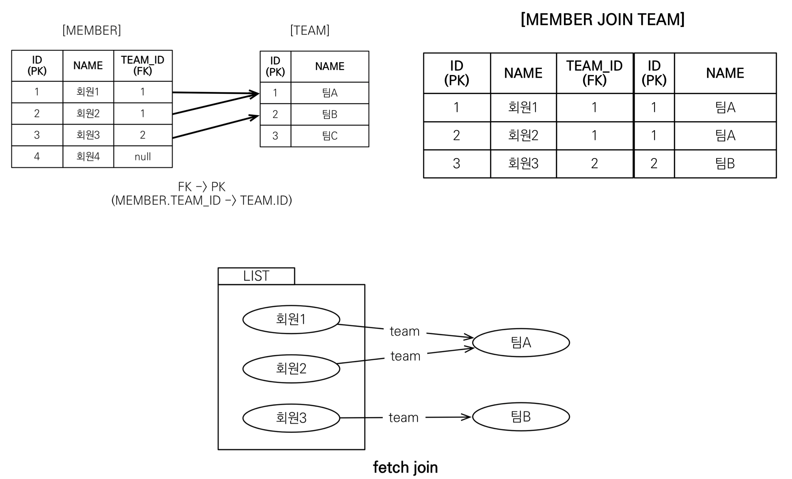
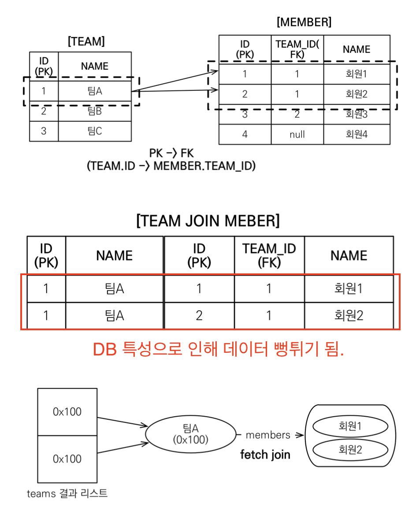
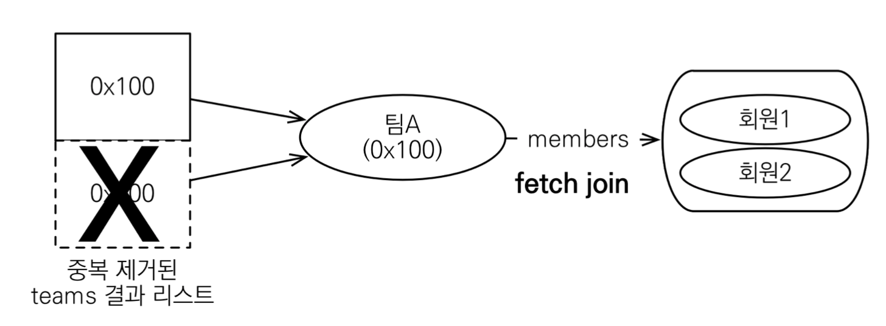
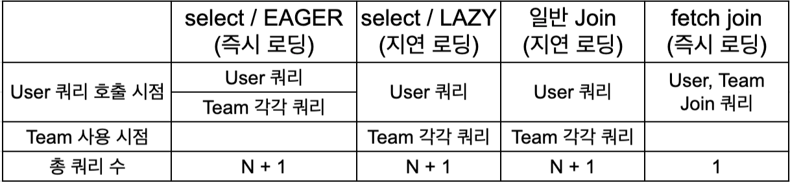
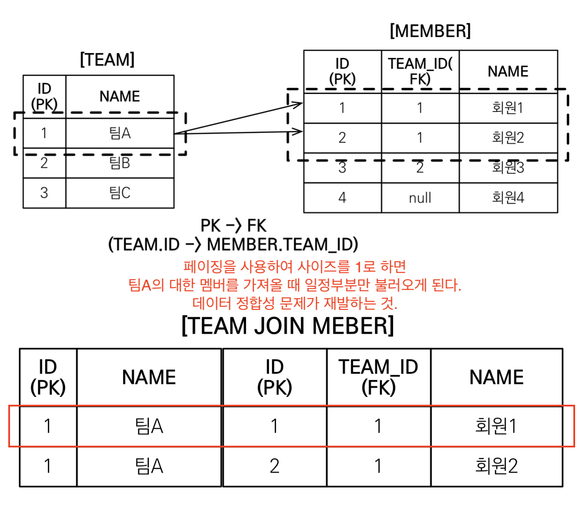
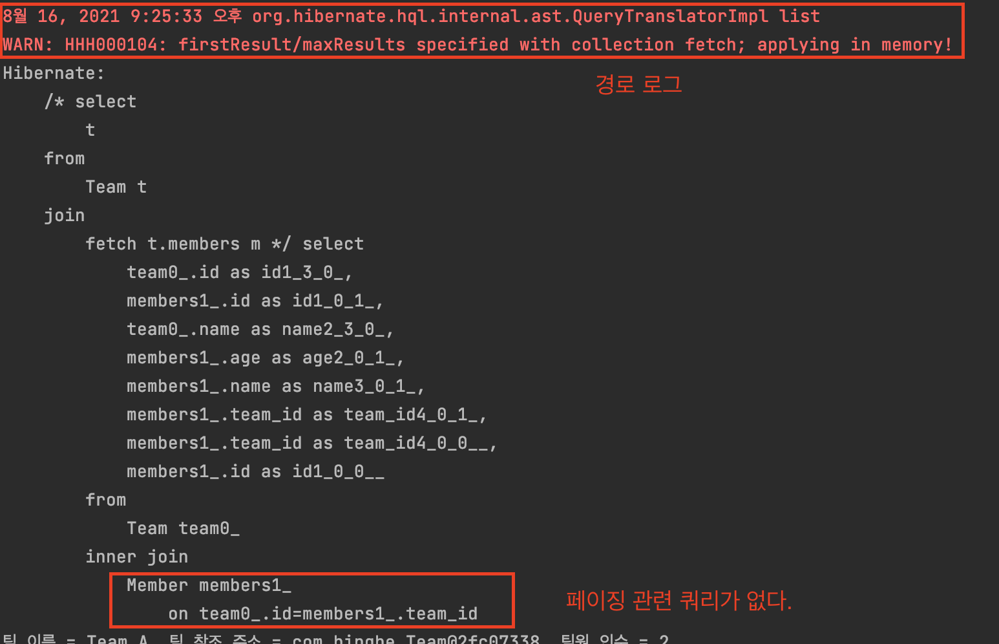
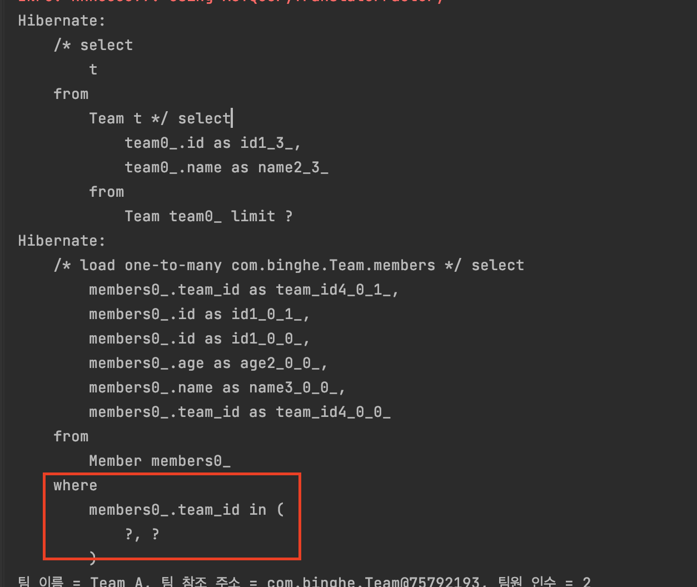

# JPA 놀이터 - fetch join

<br>

# 학습테스트 내용
- [fetch join 기본 테스트 (즉시 로딩, 지연 로딩)](./src/test/java/com/binghe/FetchJoinBasicTest.java)
- [fetch join을 사용하여 N + 1 문제 해결 테스트](./src/test/java/com/binghe/N_Plus_OneTest.java)
- [컬렉션 fetch join (1대다 조회) 테스트](./src/test/java/com/binghe/OneToManyTest.java)
- [일반 join과 fetch join의 차이](./src/test/java/com/binghe/JoinVsFetchJoinTest.java)
- [fetch join 특징과 한계 (@Batsize, 페이징 관련)](./src/test/java/com/binghe/FetchJoinLimitTest.java)

<br>

# 목차

<br>

- [목차](#목차)
- [개요](#개요)
- [패치 조인이란?](#패치-조인이란)
- [컬렉션 패치 조인 (일대다 관계)](#컬렉션-패치-조인-일대다-관계)
    - [컬렉션 패치 조인이란?](#컬렉션-패치-조인이란)
    - [패치 조인과 DISTINCT](#패치-조인과-distinct)
- [일반 join vs fetch join](#일반-join-vs-fetch-join)
- [fetch join의 특징과 한계](#fetch-join의-특징과-한계)
    - [fetch join 대상에는 별칭을 줄 수 없다.](#fetch-join-대상에는-별칭을-줄-수-없다)
    - [둘 이상의 컬렉션은 패치 조인 할 수 없다](#둘-이상의-컬렉션은-패치-조인-할-수-없다)
    - [컬렉션을 패치 조인하면 페이징 API를 사용할 수 없다](#컬렉션을-패치-조인하면-페이징-api를-사용할-수-없다)
        - [문제점](#문제점)
        - [해결 방안](#해결-방안)
- [JPQL의 즉시 로딩, 지연 로딩 그리고 fetch join (중요)](#jpql의-즉시-로딩-지연-로딩-그리고-fetch-join-중요)
    - [em.find()와 JPQL](#emfind와-jpql)
    - [JPQL의 즉시로딩](#jpql의-즉시로딩)
    - [JPQL의 지연로딩](#jpql의-지연로딩)
    - [fetch join 또는 엔티티 그래프](#fetch-join-또는-엔티티-그래프)
- [정리](#정리)

<br>

# 개요
패치 조인을 사용할 때 다음과 같이 두 가지 상황을 생각하면 쉽다.
1. 다대일 관계에서의 fetch join
2. 일대다 관계에서의 fetch join

<br>

# 패치 조인이란?
> 다대일 관계를 통해 패치 조인을 알아본다.

<br>

🤔 **패치 조인이란?**
* 사전적 의미
    * fetch: 가지고[데리고/불러]오다
* 패치 조인의 의미
    * **패치 조인은 연관된 엔티티나 컬렉션을 SQL 한 번에 함께 조회하는 기능을 의미한다.**
    * 패치 조인은 JPQL에서 성능 최적화를 위해 제공하는 기능이다.
* `join fetch`라는 명령어를 사용한다.
    * `[ LEFT [OUTER] | INNER ] JOIN FETCH 조인 경로`

<br>

:point_right: 예시 1 (다대일)

> ex. 회원을 조회하면서 연관된 팀도 함께 조회하고 싶을 경우 (SQL 한번에)

 <p align="center"><br>출처: 자바 ORM 표준 JPA 프로그래밍</p>

```sql
-- JPQL
select m from Member m join fetch m.team

-- SQL
SELECT M.*, T.* FROM MEMBER M INNER JOIN TEAM T ON M.TEAM_ID = T.ID
```

* 위 두 쿼리는 같은 의미이다.
* SQL을 보면 회원 뿐만 아니라 팀 (`T.*`)도 함께 SELECT하는 것을 볼 수 있다.
* 회원을 조회하면서 팀에 대한 내용을 한번에 가져오고 싶을 때 패치조인을 사용하면 된다.
    * inner join이기 때문에 회원 4는 가져오지 않는다.
* JPA는 패치 조인을 사용하면 회원1,2,3과 팀A,B를 한번에 가져와서 영속성 컨텍스트에서 관리시킨다.

<br>

> 중요한 사실
> * 아무리 연관관계를 LAZY 로딩으로 설정을 해도, fetch join의 우선순위가 더 높다.
    > 즉, fetch join을 사용하면 연관관계각 LAZY 여부와 상관없이 쿼리 한번으로 즉시 로딩처럼 가져온다.

<br>

# 컬렉션 패치 조인 (일대다 관계)

<br>

## 컬렉션 패치 조인이란?

<p align="center"><br>출처: 자바 ORM 표준 JPA 프로그래밍</p>

* **기준을 어디에 두느냐에 따라 데이터가 늘어난다.**
    * 다대일의 Member입장에서 데이터가 뻥튀기 되지 않는다.
    * 일대다의 Team입장에서 데이터가 뻥튀기 된다.
* 객체와 RDB의 차이
    * **SQL Join 쿼리를 통해 데이터를 가져오기 때문에, 팀 A의 행이 두 개가 된다.** (객체와 RDB의 차이점이기도 하다.)
    * 객체에선 어쩔 수 없이 가져오지만, 영속성 컨텍스트에는 `id`를 통해 판별하여 하나만 만든다. 단, 조회한 결과의 리스트 안에는 동일한 주소를 가리키는 객체 두 개를 중복해서 가지고 있는다.

<br>

## 패치 조인과 DISTINCT
> 컬렉션 패치의 중복 데이터를 가져오는 문제를 해결하는 방법으로 DISTINCT를 사용할 수 있다.
* SQL의 DISTINCT는 중복된 결과를 제거하는 명령.
* JPQL의 DISTINCT는 2 가지 기능 제공.
    1. SQL에 DISTINCT를 추가
    2. 애플리케이션에서 엔티티 중복 제거

<br>

<p align="center"><br>출처: 자바 ORM 표준 JPA 프로그래밍</p>

* JPQL에 DISTINCT를 추가해주면 SQL에 DISTINCT를 추가하지만 같은 행의 데이터가 다르므로 SQL 결과에선 중복제거가 실패한다.
* 하지만 JPQL DISTINCT는 엔티티의 중복도 지원하므로, 같은 식별자를 가진 엔티티를 제거해준다.

<br>

# 일반 join vs fetch join
🤔 패치 조인은 기존 SQL의 조인이 아니라고한다. 그렇다면 둘의 차이점은?

* 일반 join은 연관된 엔티티를 함께 조회하지 않는다.
    * 프록시로 두고, 사용할 때 지연 로딩하게 된다.
* 일반 join `select t from Team t join t.members m`
    * JPQL은 결과를 반환할 때 연관관계 고려 X
        * **단지 SELECT 절에 지정한 엔티티만 조회할 뿐이다.**
        * 즉, 팀 엔티티만 조회하고, 회원 엔티티는 조회하지 않는다.
* fetch join `select t from Team t join fetch t.members`
    * fetch join을 사용할 때만 연관된 엔티티도 함께 조회한다. (**즉시 로딩**)
    * **fetch join은 객체 그래프를 SQL 한번에 조회하는 개념**

<br>

😎 **JPQL (`em.find()`말고)만을 사용한다고 했을 때 아래와 같다.**

<p align="center"></p>

> `em.find()`로 User 엔티티를 직접 조회할 때 즉시 로딩이면 User, Team을 Join쿼리로 한번에 조회한다.

<br>

# fetch join의 특징과 한계

<br>

## fetch join 대상에는 별칭을 줄 수 없다.
* 패치 조인은 특정 엔티티와 연관된 엔티티를 모두 불러오는 기능이다.
    * 그러므로, **패치 조인은 join 대상 엔티티에 별칭을 가급적 사용하지 않는 것이 좋다.**
* **만약 중간에 성능을 생각해서 별칭을 사용해서 필터링을 해야한다면 패치 조인을 사용하지 않는 것이 좋다.**
    * ex, **팀A의 멤버중 한 명만 불러온다면, 나머지 네 명이 누락되어서 이상하게 동작할 수도 있기 때문이다.**
    * **영속성 전이와 고아 객체가 복잡하게 설계되어 있으면, 잘못하면 데이터가 지워지는 일까지 발생할 수 있다.**
    * `select t from Team t join fetch t.members m where m.age > 10` -> 패치 조인에 별칭을 사용한 예시
* 즉, JPA에서 패치 조인을 설계한 의도와 다르기 때문에 별칭을 사용하지 않는 것이 좋다.
    * **JPA에서의 패치 조인 설계는 객체 그래프 탐색이다**. 즉, **팀A의 멤버는 모두 가져오는게 설계 의도이다.**
    * 즉, **데이터 정합성** 이슈때문에 별칭을 사용하지 않는 것이 좋다.

<br>

> 만약 팀과 연관된 멤버 엔티티 각각 5개씩만 가지고 오고 싶다면, 이경우 팀을 통해 멤버를 불러오지 말고, 처음부터 멤버를 가지고 오는 것을 추천한다. (패치 조인이 아닌 `SELECT m`을 통해서 조회)

<br>

> 여러 단계로 패치 조인 (패치 조인을 여러번 사용해야 할 경우)을 사용해야할 경우엔 부득이하게 사용할 수도 있다고 한다. ex. A -> B -> C

<br>

## 둘 이상의 컬렉션은 패치 조인 할 수 없다
* **1대다도 데이터 뻥튀기가 되는데, 둘 이상의 컬렉션은 1대다대다이므로, 곱하기 곱하기 연산이 나오게 된다.**
    * 잘못하면 데이터가 예상하지 못하게 늘어난다.

<br>

## 컬렉션을 패치 조인하면 페이징 API를 사용할 수 없다
> 페이징 API: setFirstResult, setMaxResult

<br>

### 문제점
* 일대일, 다대일 같은 단일 값 연관 필드들은 패치 조인해도 페이징이 가능하다.
* 하이버네이트는 경고 로그를 남기고 메모리에서 페이징한다.
    * 이 부분이 굉장히 위험하다고 한다.

<br>

:point_right: 예시

<p align="center"><br>출처: 자바 ORM 표준 JPA 프로그래밍</p>

* 팀 A에 대한 데이터를 가져올 때, 사이즈를 1로하면 팀A에 대한 회원 정보를 일정 부분만 불러오게 된다.
    * 즉, 데이터 정합성 문제가 재발한다.
* 팀 A에 대한 다른 정보를 더 가져오기 위해선 다음 페이지를 불러와야하므로 좋지 않다.

<br>

실제로 아래와 같이 코드를 작성하면

```java
// when
String query = "select t from Team t join fetch t.members m";
TypedQuery<Team> result = entityManager.createQuery(query, Team.class)
    .setFirstResult(0)
    .setMaxResults(1);
List<Team> findTeams = result.getResultList();
```

아래와 같이 **경고 로그**를 띄운다. **게다가 아래와 같이 페이징 쿼리가 날라가지 않고, 패치 조인을 통해 DB로부터 한번에 데이터를 가져온 다음에 메모리에 저장하고 있게 된다.** (메모리 누수 발생할 확률이 높음)

<p align="center"><br>출처: 자바 ORM 표준 JPA 프로그래밍</p>

**즉, 절대 사용하면 안된다!**

<br>

> 컬렉션 패치 조인에서 `distinct`를 사용하면 어떻게 될까?
> * JPA에서는 paging하면서 컬렉션 관계를 fetch join 하는 것을 지양하기 때문에, distinct를 적용하는 것도 성립하지 않는다.
> * 즉, 컬렉션 패치 조인 자체를 사용하지 말라는 의미.

<br>

### 해결 방안
> 그렇다면 컬렉션 패치 조인을 해야할 때 어떤 해결방안이 있을까?

**1. 일대다(컬렉션)쿼리를 다대일처럼 변경하는 방법**
* `select m from Member m join fetch m.team`

<br>

**2. @BatchSize를 사용하는 방법**

```java
@Entity
public class Team {
    ...

    @BatchSize(size = 100)
    @OneToMany(mappedBy = "team")
    private List<Member> members = new ArrayList<>();

    ...
}
```
일대다(컬렉션)관계에 `@BatchSize`를 붙여준다.

그리고 다음과 같이 쿼리를 짜면

```java
String query = "select t from Team t";
TypedQuery<Team> result = entityManager.createQuery(query, Team.class)
    .setFirstResult(0)
    .setMaxResults(2);
List<Team> findTeams = result.getResultList();
```

<p align="center"> </p>

`where`혹은 `where in`을 사용해서 한번에 데이터를 불러온다.

<br>

> * BatchSize와 패치 조인의 차이점
    >   * 공통점으로는 둘 다 N + 1에 대한 해결책.
>   * BatchSize는 where in을 사용해서 한번에 가져오는 쿼리.
>   * fetch join은 inner join을 해서 한번에 select 해오는 쿼리.

<br>

# JPQL의 즉시 로딩, 지연 로딩 그리고 fetch join (중요)

<br>

## em.find()와 JPQL
* `em.find()`등을 통해서 엔티티 하나만 조회할 때는 즉시 로딩으로 설정하면 연관된 팀도 한 쿼리로 가져오도록 최적화 되어 있다. (묵시적 일반 `join`)
* JPQL은 반대로 연관관계를 즉시 로딩으로 설정하는 것과 상관없이 JPQL 자체만으로 SQL로 그대로 번역하게 된다.

<br>

## JPQL의 즉시로딩
1. 멤버 전체를 조회하기 위해 JPQL 실행 (`select m from Member m`)
2. JPQL은 EAGER와 무관하게 SQL로 그대로 번역 (`select m.* from Member`)
3. JPQL결과가 member만 조회하고, team은 조회하지 않는다.
4. member와 team이 즉시 로딩으로 설정되어 있기 때문에, 연관된 팀을 각각 쿼리를 날려서 추가 조회한다. (N + 1 발생)

<br>

## JPQL의 지연로딩
1. 멤버 전체를 조회하기 위해 JPQL 실행 (`select m from Member m`)
2. JPQL은 EAGER와 무관하게 SQL로 그대로 번역 (`select m.* from Member`)
3. JPQL 결과가 member만 조회하고, team은 조회하지 않는다.
4. member와 team이 지연 로딩으로 설정되어 있기 때문에 가짜 프록시 객체를 넣어두고, 실제 member의 team은 조회하지 않는다.
5. 실제 team을 사용하는 시점에 쿼리를 날려서 각가 조회한다. (N + 1 발생)

<br>

## fetch join 또는 엔티티 그래프
> EAGER, LAZY와 상관 없이 동작한다.

1. member와 team을 한번에 조회하기 위해 JPQL + fetch join 실행 (`select m from Member m join fetch m.team`)
2. JPQL에서 fetch join을 사용했으므로 SQL은 멤버와 팀을 한 쿼리로 조회 (`select m.*, t.* from member join team ...`)
3. JPQL 결과가 member와 team을 한꺼번에 조회한다.
4. member와 team이 fetch join으로 한번에 조회되었으므로 N + 1 문제가 발생하지 않는다.

<br>

# 정리
* 모든 것을 패치 조인으로 해결할 수 없다.
* 패치 조인은 **객체 그래프를 유지할 때 사용하면 효과적**
* **여러 테이블을 조인해서 엔티티가 가진 모양이 아닌 전혀 다른 결과를 내야 하면, 패치 조인보다는 일반 조인을 사용하고 필요한 데이터들만 조회해서 DTO로 반환하는 것이 효과적이다.**


