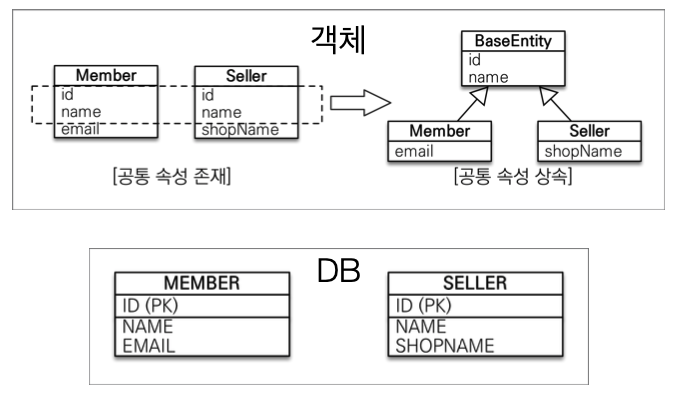

# JPA 놀이터 - @MappedSuperClass

 

# 학습테스트 내용

 

# @MappedSuperclass
> 상속관계랑 별로 상관없다.

 출처: 자바 ORM 표준 JPA 프로그래밍

* **MappedSuperClass란?**
  * **테이블과 관계 없고, 단순히 엔티티가 공통으로 사용하는 매핑 정보를 모으는 역할.**
  * 주로 등록일, 수정일, 등록자, 수정자 같은 전체 엔티티에서 공통으로 적용하는 정보를 모을 때 사용된다.
* **JPA에서의 상속**
  * **엔티티 클래스는 `@Entity`나 `@MappedSuperclass`로 지정한 클래스만 상속가능하다.**
* **주의할 점**
  * `@MappedSuperclass`는 상속관계 매핑이 아니다!
  * `@MappedSuperclass`는 엔티티도 아니고, 테이블과 매핑도 안된다. (테이블도 없음)
  * 조회, 검삭 불가 (`em.find(BaseEntity.class, ...)` 불가)
  * 직접 생성해서 사용할 일이 없으므로 추상 클래스를 권장한다.
  
